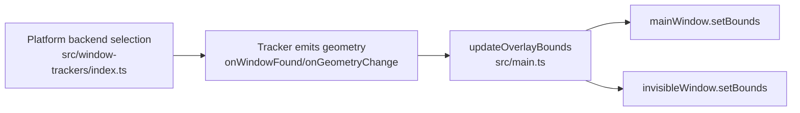
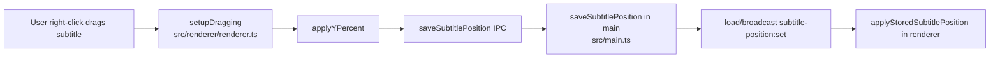
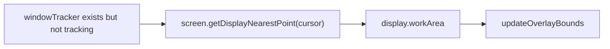

# Overlay Positioning Flow

## 1) Window Bounds Flow (visible + invisible Electron windows)

## 2) Invisible Subtitle Layout Flow (mpv render metrics -> DOM layout)

```mermaid
flowchart LR
  A[mpv property changes<br/>sub-pos, sub-font-size, osd-dimensions, etc.] --> B[MpvIpcClient parses events<br/>src/main.ts]
  B --> C[updateMpvSubtitleRenderMetrics<br/>src/main.ts]
  C --> D[broadcast mpv-subtitle-render-metrics:set]
  D --> E[preload onMpvSubtitleRenderMetrics<br/>src/preload.ts]
  E --> F[renderer receives metrics event<br/>src/renderer/renderer.ts]
  F --> G[applyInvisibleSubtitleLayoutFromMpvMetrics]
  G --> H[subtitleContainer/subtitleRoot inline styles updated]
```

## 3) Visible Subtitle Manual Position Flow

## 4) Fallback Bounds Flow (tracker not ready)

## Key Files

- `src/main.ts`
- `src/renderer/renderer.ts`
- `src/preload.ts`
- `src/window-trackers/base-tracker.ts`
- `src/window-trackers/index.ts`
