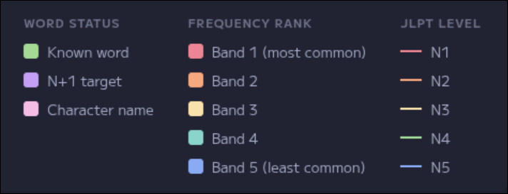
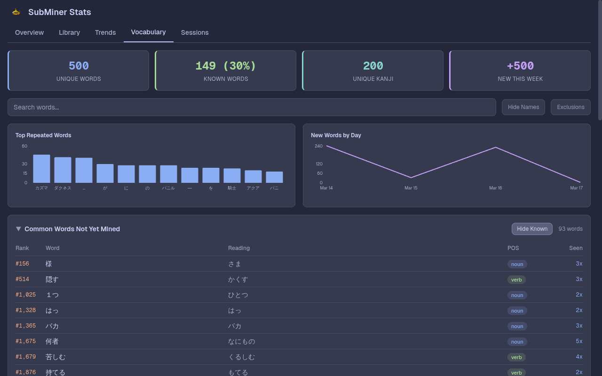
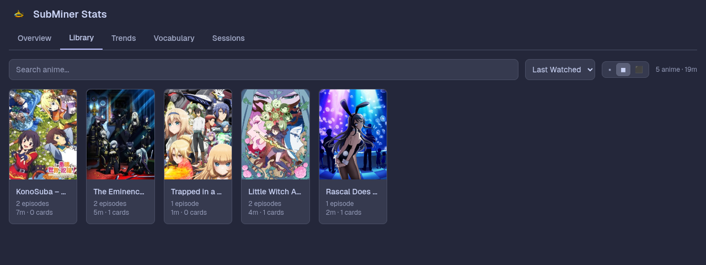

<div align="center">
  
  <h1>SubMiner</h1>
  <strong>Look up words, mine to Anki, and enrich cards with context — without leaving mpv.</strong>
  <br /><br />

[](https://www.gnu.org/licenses/gpl-3.0)
[]()
[](https://docs.subminer.moe)

</div>

<br />

<div align="center">

[](./assets/minecard.mp4)

</div>

<br />

## What it does

SubMiner is an Electron overlay that sits on top of mpv. It turns your video player into a full sentence-mining workstation — look up any word with Yomitan, mine it to Anki with one key, and track your immersion progress over time.

## Features

### Dictionary Lookups While You Watch

Yomitan runs directly inside the overlay. Hover over any word in the subtitles or navigate with keyboard/controller to get full dictionary popups without pausing or switching windows.

### One-Key Anki Mining

Press a single key to send a word to Anki. SubMiner auto-fills the card with the sentence, audio clip, screenshot, and machine translation — all captured from the exact moment you looked it up.

<div align="center">
  
</div>

### Reading Annotations

Subtitles are annotated in real time with N+1 targeting, frequency-dictionary highlighting, JLPT level tags, and a character name dictionary for anime and manga proper nouns.

<div align="center">
  
  <br/>
  
</div>

### Immersion Dashboard

A local stats dashboard tracks your watch time, anime progress, vocabulary growth, mining throughput, and session history. Drill down into individual sessions or browse your full library.

<div align="center">
  
  <br /><br />
  
  <br /><br />
  <!--  -->
</div>

### External Integrations

- **AniList** — Automatic episode progress tracking
- **Jellyfin** — Remote playback, cast device mode
- **Subtitle tools** — Download from Jimaku, sync with alass/ffsubsync
- **Texthooker & API** — Custom texthooker page and annotated websocket feed for external clients

<div align="center">
  
</div>

## Quick start

### 1. Install

**Arch Linux (AUR):**

Install [`subminer-bin`](https://aur.archlinux.org/packages/subminer-bin) from the AUR. It installs the packaged AppImage plus the `subminer` wrapper:

```bash
paru -S subminer-bin
```

Or manually:

```bash
git clone https://aur.archlinux.org/subminer-bin.git
cd subminer-bin
makepkg -si
```

**Linux (AppImage):**

```bash
wget https://github.com/ksyasuda/SubMiner/releases/latest/download/SubMiner.AppImage -O ~/.local/bin/SubMiner.AppImage \
	&& chmod +x ~/.local/bin/SubMiner.AppImage
wget https://github.com/ksyasuda/SubMiner/releases/latest/download/subminer -O ~/.local/bin/subminer \
	&& chmod +x ~/.local/bin/subminer

```

> [!NOTE]
> The `subminer` wrapper uses a [Bun](https://bun.sh) shebang. Make sure `bun` is on your `PATH`.

**macOS (DMG/ZIP):** download the latest packaged build from [GitHub Releases](https://github.com/ksyasuda/SubMiner/releases/latest) and drag `SubMiner.app` into `/Applications`.

**Windows (Installer/ZIP):** download the latest `SubMiner-<version>.exe` installer or portable `.zip` from [GitHub Releases](https://github.com/ksyasuda/SubMiner/releases/latest). Keep `mpv` installed and available on `PATH`.

**From source** — see [docs.subminer.moe/installation#from-source](https://docs.subminer.moe/installation#from-source).

### 2. Launch the app once

```bash
# Linux
SubMiner.AppImage
```

On macOS, launch `SubMiner.app`. On Windows, launch `SubMiner.exe` from the Start menu or install directory.

On first launch, SubMiner:

- starts in the tray/background
- creates the default config directory and `config.jsonc`
- opens a compact setup popup
- can install the mpv plugin to the default mpv scripts location for you
- links directly to Yomitan settings so you can install dictionaries before finishing setup

### 3. Finish setup

- click `Install mpv plugin` if you want the default plugin auto-start flow
- click `Open Yomitan Settings` and install at least one dictionary
- click `Refresh status`
- click `Finish setup`

The mpv plugin step is optional. Yomitan must report at least one installed dictionary before setup can be completed.

### 4. Mine

```bash
subminer video.mkv # default plugin config auto-starts visible overlay + resumes playback when ready
subminer --start video.mkv # optional explicit overlay start when plugin auto_start=no
subminer stats # open the local stats dashboard in your browser
```

## Requirements

| Required                                   | Optional                                           |
| ------------------------------------------ | -------------------------------------------------- |
| `bun` (source builds, Linux `subminer`)    |                                                    |
| `mpv` with IPC socket                      | `yt-dlp`                                           |
| `ffmpeg`                                   | `guessit` (better AniSkip title/episode detection) |
| `mecab` + `mecab-ipadic`                   | `fzf` / `rofi`                                     |
| Linux: `hyprctl` or `xdotool` + `xwininfo` | `chafa`, `ffmpegthumbnailer`                       |
| macOS: Accessibility permission            |                                                    |

Windows builds use native window tracking and do not require the Linux compositor helper tools.

## Documentation

For full guides on configuration, Anki, Jellyfin, immersion tracking/stats, and more, see [docs.subminer.moe](https://docs.subminer.moe). The VitePress source for that site lives in [`docs-site/`](./docs-site/).

## Acknowledgments

Built on the shoulders of [GameSentenceMiner](https://github.com/bpwhelan/GameSentenceMiner), [Renji's Texthooker Page](https://github.com/Renji-XD/texthooker-ui), [Anacreon-Script](https://github.com/friedrich-de/Anacreon-Script), and [Bee's Character Dictionary](https://github.com/bee-san/Japanese_Character_Name_Dictionary). Subtitles powered by [Jimaku.cc](https://jimaku.cc). Dictionary lookups via [Yomitan](https://github.com/yomidevs/yomitan), and JLPT tags from [yomitan-jlpt-vocab](https://github.com/stephenmk/yomitan-jlpt-vocab).

## License

[GNU General Public License v3.0](LICENSE)
