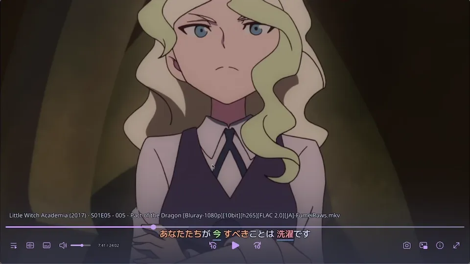
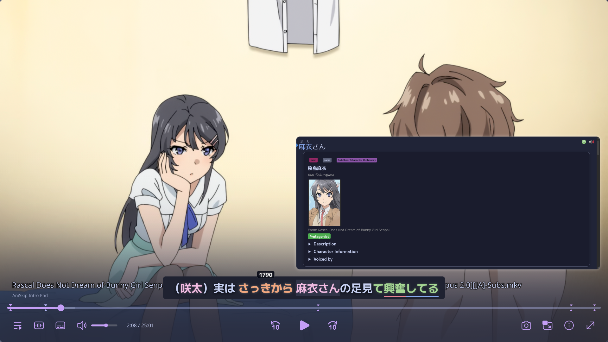
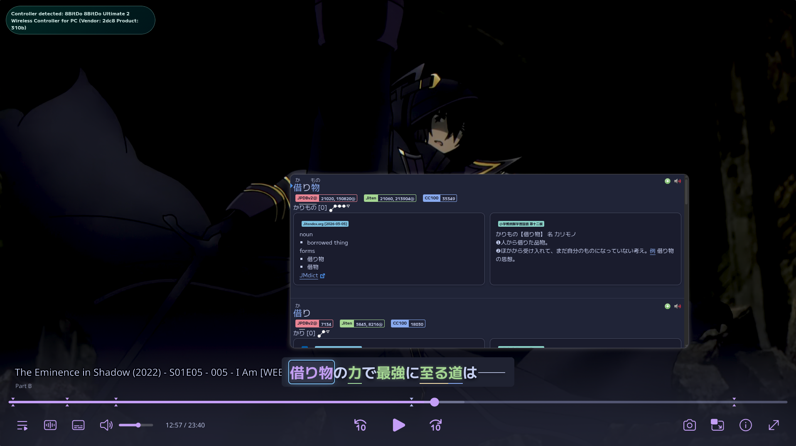
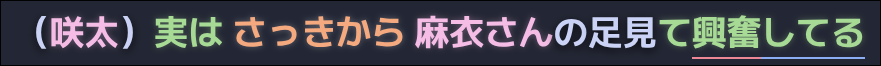
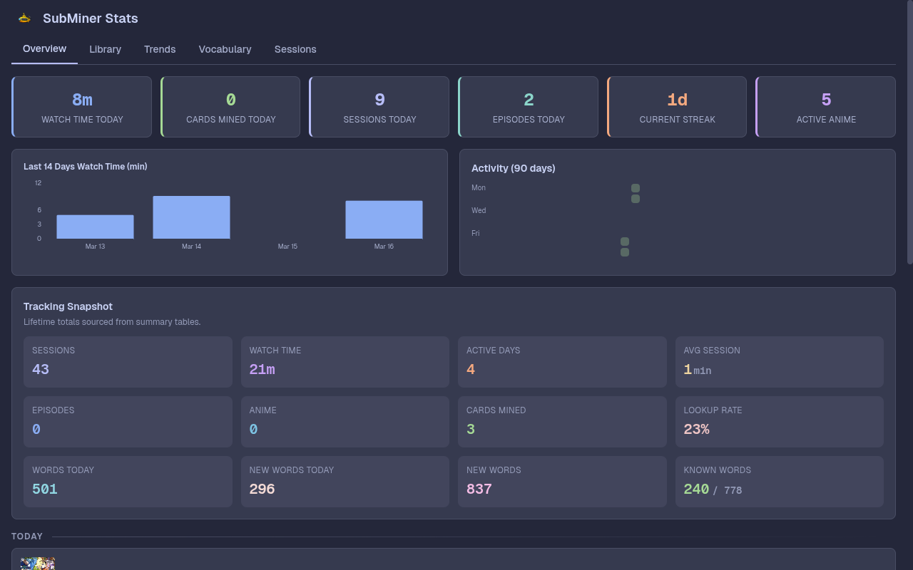
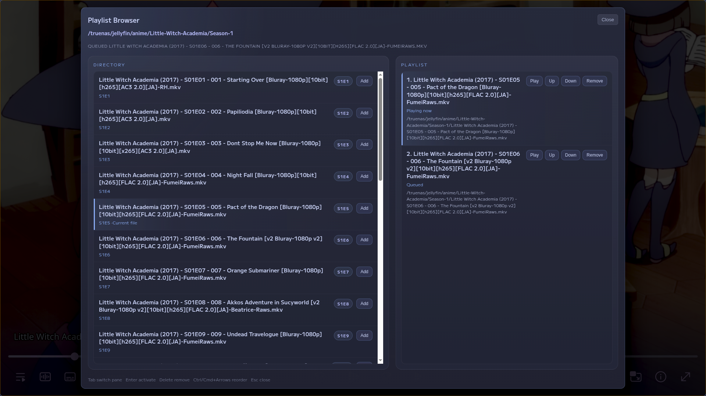
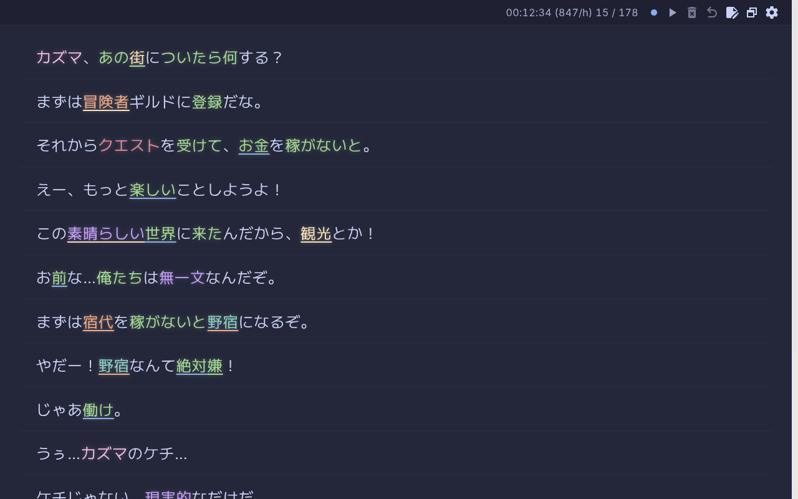

<div align="center">


# SubMiner

Integrates Yomitan and mpv - on-screen lookups, mine to Anki, and track immersion without leaving the player

[Installation](#quick-start) · [Requirements](#requirements) · [Usage](https://docs.subminer.moe/usage) · [Documentation](https://docs.subminer.moe)

[](https://github.com/ksyasuda/SubMiner/releases)
[](https://github.com/ksyasuda/SubMiner/releases/latest)
[](https://aur.archlinux.org/packages/subminer-bin)
[](https://github.com/ksyasuda/SubMiner)
[](https://www.gnu.org/licenses/gpl-3.0)
[](https://www.typescriptlang.org)

[](https://github.com/user-attachments/assets/89e61895-e2b7-4b47-8d50-a35afe4132b2)

</div>

## Features

### Dictionary Lookups

Hover over any word and trigger a lookup to get the full Yomitan popup - definitions, pitch accent, and frequency data - without ever leaving mpv.

<div align="center">
  
</div>

<br>

### Instant Anki Mining

Create an Anki card with the sentence, audio clip, screenshot, and machine translation from the exact playback moment with one key press, click, or controller input.

<div align="center">
  
</div>

<br>

### Reading Annotations

Real-time subtitle annotations with frequency highlighting, JLPT tags, N+1 targeting, and a character name dictionary. Grammar-only tokens and particles render as plain text so you focus on what matters.

<div align="center">
  
</div>

<br>

### Immersion Dashboard

Local stats dashboard tracking watch time, vocabulary growth, mining throughput, session history, and trends. All stored locally, no third-party tracking.

<div align="center">
  
</div>

<br>

### Playlist Browser

Browse sibling episode files and the active mpv queue in one overlay modal. Open it with `Ctrl+Alt+P` to append episodes from the current directory, jump to queued items, remove entries, or reorder the playlist without leaving playback.

<div align="center">
  
</div>

<br>

### Integrations

<table>
  <tr>
    <td><b>YouTube</b></td>
    <td>Auto-loaded yt-dlp subtitle tracks at startup with config-driven primary/secondary language priorities and a manual overlay picker on demand (<code>Ctrl+Alt+C</code>)</td>
  </tr>
  <tr>
    <td><b>AniList</b></td>
    <td>Automatic episode tracking and progress sync</td>
  </tr>
  <tr>
    <td><b>Jellyfin</b></td>
    <td>Browse, launch, and cast media from your Jellyfin server with setup and discovery controls in the app tray</td>
  </tr>
  <tr>
    <td><b>Anime Browser</b></td>
    <td>Search anime sources you supply as <a href="https://github.com/aniyomiorg/aniyomi">Aniyomi</a> extension APKs and play an episode in mpv with the overlay attached (<code>subminer anime</code>); SubMiner ships no repositories and bundles no sources</td>
  </tr>
  <tr>
    <td><b>Jimaku</b></td>
    <td>Search and download Japanese subtitles</td>
  </tr>
  <tr>
    <td><b>TsukiHime</b></td>
    <td>Search and download subtitles extracted from anime releases, with Japanese and secondary-language tabs (<code>Ctrl+Shift+T</code>) — no API key, requires <code>xz</code> on your <code>PATH</code></td>
  </tr>
  <tr>
    <td><b>AniSkip</b></td>
    <td>Automatic intro detection with chapter markers and a one-key skip (<code>TAB</code> by default)</td>
  </tr>
  <tr>
    <td><b>alass / ffsubsync</b></td>
    <td>Manual subtitle retiming — requires <code>alass</code> or <code>ffsubsync</code> on your <code>PATH</code> (optional; subtitle syncing is disabled without them)</td>
  </tr>
  <tr>
    <td><b>WebSocket</b></td>
    <td>Plain subtitle feed plus a dedicated annotated feed for texthooker pages and custom tools</td>
  </tr>
</table>

<div align="center">
  
</div>

<br>

---

## Requirements

Only **mpv** is required to run SubMiner. Anki + AnkiConnect are required to mine cards, which is the point of the app, but everything else is optional.

| Dependency           | Status           | What it does                                             |
| -------------------- | ---------------- | -------------------------------------------------------- |
| mpv                  | Required         | The video player SubMiner overlays on                    |
| Anki + AnkiConnect   | Required to mine | Card creation from the Yomitan popup                     |
| ffmpeg               | Recommended      | Audio clips & screenshots for Anki cards                 |
| MeCab + mecab-ipadic | Recommended      | More precise annotations and filtering                   |
| yt-dlp               | Optional         | YouTube playback                                         |
| xz                   | Optional         | TsukiHime subtitle downloads (not on Windows by default) |
| alass / ffsubsync    | Optional         | Subtitle sync                                            |
| guessit              | Optional         | Better anime title and episode detection                 |
| fzf / rofi           | Optional         | Video picker in the `subminer` launcher (Linux/macOS)    |

<details>
<summary><b>Platform-specific install commands</b></summary>

**Arch Linux:**

```bash
sudo pacman -S --needed mpv ffmpeg mecab mecab-ipadic
```

**macOS:**

```bash
brew install mpv ffmpeg mecab mecab-ipadic
```

**Windows:**

```powershell
winget install shinchiro.mpv
winget install Gyan.FFmpeg
```

Then reopen your terminal and check `mpv --version` and `ffmpeg -version`. winget puts `ffmpeg` on `PATH` automatically; mpv uses a regular installer that may not, so if `mpv` is not found, either add its folder (usually `%LOCALAPPDATA%\Programs\mpv`) to `PATH` or set `mpv.executablePath` during first-run setup.

[Scoop](https://scoop.sh) is the alternative if you want one package manager for everything, since it is the only one that also carries `xz`:

```powershell
scoop bucket add extras
scoop install extras/mpv main/ffmpeg main/yt-dlp main/xz
```

See the [full requirements list](https://docs.subminer.moe/installation#_1-install-requirements) for optional dependencies.

</details>

---

## Quick Start

### 1. Install SubMiner

<details>
<summary><b>Arch Linux (AUR)</b></summary>

```bash
paru -S subminer-bin
# optional: the anime browser bridge, shared with Mangatan and updated by pacman
paru -S mangatan-extension-server
```

</details>

<details>
<summary><b>Linux (AppImage)</b></summary>

```bash
mkdir -p ~/.local/bin
wget https://github.com/ksyasuda/SubMiner/releases/latest/download/SubMiner.AppImage -O ~/.local/bin/SubMiner.AppImage \
 && chmod +x ~/.local/bin/SubMiner.AppImage
```

The AppImage is all you need. The optional `subminer` command-line launcher runs on [Bun](https://bun.sh), and first-run setup can install both for you. To grab it manually instead, install Bun first, then:

```bash
wget https://github.com/ksyasuda/SubMiner/releases/latest/download/subminer -O ~/.local/bin/subminer \
 && chmod +x ~/.local/bin/subminer
```

</details>

<details>
<summary><b>macOS (DMG)</b></summary>

Download the latest DMG from [GitHub Releases](https://github.com/ksyasuda/SubMiner/releases/latest) and drag `SubMiner.app` into `/Applications`.

</details>

<details>
<summary><b>Windows</b></summary>

Download and run the latest installer (`.exe`) from [GitHub Releases](https://github.com/ksyasuda/SubMiner/releases/latest).

</details>

<details>
<summary><b>From source</b></summary>

See the [build-from-source guide](https://docs.subminer.moe/installation#from-source).

</details>

### 2. Launch & Set Up

Run SubMiner and the first-run setup wizard will guide you through importing Yomitan dictionaries and optionally installing the `subminer` command-line launcher.

```bash
# Linux
subminer app --setup

# macOS — open SubMiner.app, or:
subminer app --setup
```

On **Windows**, just run `SubMiner.exe` and the setup will open automatically on first launch.

### 3. Mine

```bash
subminer video.mkv          # launch mpv with SubMiner
subminer /path/to/dir       # pick a file with fzf
subminer -R /path/to/dir    # pick a file with rofi (Linux only)
subminer -H                 # browse history, then previous / replay / next / select / quit
```

On **Windows**, use the **SubMiner mpv** shortcut created during setup. Double-click it or drag a video file onto it.

## Documentation

Full guides on configuration, Anki setup, Jellyfin, immersion tracking, and more: **[docs.subminer.moe](https://docs.subminer.moe)**

---

## Acknowledgments

SubMiner builds on the work of these open-source projects:

| Project                                                                                     | Role                                                                         |
| ------------------------------------------------------------------------------------------- | ---------------------------------------------------------------------------- |
| [ani-skip](https://github.com/synacktraa/ani-skip)                                          | AniSkip API client for anime intro/outro skip timestamps                     |
| [Anacreon-Script](https://github.com/friedrich-de/Anacreon-Script)                          | Inspiration for the mining workflow                                          |
| [Aniyomi](https://github.com/aniyomiorg/aniyomi)                                            | Anime extension API and data model the anime browser targets                 |
| [asbplayer](https://github.com/killergerbah/asbplayer)                                      | Inspiration for subtitle sidebar and logic for YouTube subtitle parsing      |
| [Bee's Character Dictionary](https://github.com/bee-san/Japanese_Character_Name_Dictionary) | Character name recognition in subtitles                                      |
| [GameSentenceMiner](https://github.com/bpwhelan/GameSentenceMiner)                          | Inspiration for Electron overlay with Yomitan integration                    |
| [jellyfin-mpv-shim](https://github.com/jellyfin/jellyfin-mpv-shim)                          | Jellyfin integration                                                         |
| [Jimaku.cc](https://jimaku.cc)                                                              | Japanese subtitle search and downloads                                       |
| [M-Extension-Server](https://github.com/1Selxo/M-Extension-Server)                          | Runs Aniyomi extension APKs off Android; the bridge the anime browser drives |
| [Mangatan](https://github.com/1Selxo/Mangatan)                                              | Reference client for the bridge protocol the anime browser speaks            |
| [Renji's Texthooker Page](https://github.com/Renji-XD/texthooker-ui)                        | Base for the WebSocket texthooker integration                                |
| [Yomitan](https://github.com/yomidevs/yomitan)                                              | Dictionary engine powering all lookups and the morphological parser          |
| [yomitan-jlpt-vocab](https://github.com/stephenmk/yomitan-jlpt-vocab)                       | JLPT level tags for vocabulary                                               |

## License

[GNU General Public License v3.0](LICENSE)

The anime browser drives [M-Extension-Server](https://github.com/1Selxo/M-Extension-Server),
downloaded from its upstream releases at runtime rather than
bundled or redistributed here; its bundles carry their own dependencies, including a JRE and
GPL-3.0 NewPipe Extractor. SubMiner includes none of them and talks to the bridge
over its own HTTP protocol. It ships no extensions or repositories by default.
