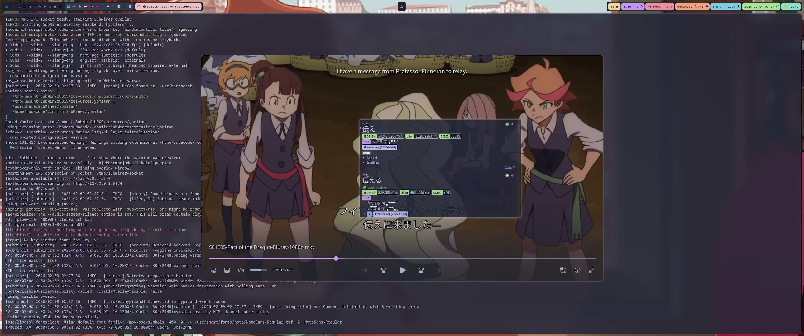

<div align="center">
  
  <h1>SubMiner</h1>
  <p>Immersion mining overlay for mpv — look up words, mine to Anki, and enrich cards with context without leaving the video.</p>
</div>

---

[](https://github.com/user-attachments/assets/9235a554-ea51-4284-b14b-7bbf3defaf58)

## Features

- **Yomitan Integration** — Hover subtitle words to trigger dictionary lookups in the player
- **Anki Card Enrichment** — Fills sentence, audio, screenshot, and translation on new cards automatically
- **Dual-Layer Subtitles** — Interactive visible overlay + invisible click-through layer aligned with mpv rendering
- **N+1 Highlighting** — Marks known vocabulary from your Anki deck so you can spot new words at a glance
- **Texthooker & WebSocket** — Built-in texthooker page with WebSocket streaming for external tools
- **Subtitle Download & Sync** — Search Jimaku, sync with alass or ffsubsync — all from the player
- **Queue Control In-Player** — Drop videos on overlay to load/queue in mpv; `Ctrl/Cmd+A` appends clipboard path
- **Keyboard-Driven** — Mine, copy, cycle display modes, and navigate from configurable shortcuts
- **Config Hot Reload** — Apply subtitle style and shortcut updates from `config.jsonc` without restarting
- **Japanese Tokenization** — MeCab-powered word boundary detection with smart grouping

## Requirements

- `mpv` with IPC socket support
- `mecab` and `mecab-ipadic`
- Linux: Hyprland (`hyprctl`) or X11 (`xdotool` + `xwininfo`)
- macOS: Accessibility permission for window tracking

Optional: `yt-dlp`, `fzf`, `rofi`, `chafa`, `ffmpegthumbnailer`

## Install

### Linux (AppImage)

```bash
wget https://github.com/ksyasuda/SubMiner/releases/download/v0.1.0/SubMiner-0.1.0.AppImage -O ~/.local/bin/SubMiner.AppImage
chmod +x ~/.local/bin/SubMiner.AppImage
wget https://github.com/ksyasuda/SubMiner/releases/download/v0.1.0/subminer -O ~/.local/bin/subminer
chmod +x ~/.local/bin/subminer
```

The `subminer` wrapper uses a [Bun](https://bun.sh) shebang, so `bun` must be on `PATH`.

### From Source

```bash
git clone --recurse-submodules https://github.com/ksyasuda/SubMiner.git
cd SubMiner
bun install
cd vendor/texthooker-ui && bun install && cd ../..
make build
make install
```

For macOS builds and platform details, see the [installation docs](docs/installation.md).

## Quick Start

1. Copy [`config.example.jsonc`](config.example.jsonc) to `~/.config/SubMiner/config.jsonc`
   - Regenerate anytime from source: `make generate-example-config` or `bun run generate:config-example`
2. Start mpv with IPC:
   ```bash
   mpv --input-ipc-server=/tmp/subminer-socket video.mkv
   ```
3. Launch SubMiner:
   ```bash
   subminer video.mkv
   ```

Config tip: while SubMiner is running, safe config edits (subtitle style, keybindings, shortcuts, secondary subtitle default mode, and `ankiConnect.ai`) hot-reload automatically.

```bash
subminer                        # pick video from cwd (fzf)
subminer -R                     # rofi picker
subminer -d ~/Videos            # set source directory
subminer -r -d ~/Anime          # recursive search
subminer -p gpu-hq video.mkv    # override mpv profile
subminer -T video.mkv           # disable texthooker
subminer https://youtu.be/...   # YouTube playback
subminer jellyfin -d            # Jellyfin cast discovery mode
subminer doctor                 # dependency/config/socket diagnostics
subminer config path            # print active config file path
subminer mpv status             # mpv socket readiness check
```

### Launcher Subcommands

- `subminer jellyfin` / `subminer jf` — Jellyfin workflows (`-d` discovery, `-p` play, `-l` login)
- `subminer yt` / `subminer youtube` — YouTube shorthand (`-o/--out-dir`, `-m/--mode`)
- `subminer doctor` — quick environment health checks
- `subminer config path|show` — inspect active config path/content
- `subminer mpv status|socket|idle` — mpv socket and idle-launch helpers
- `subminer texthooker` — texthooker-only shortcut

Use `subminer <subcommand> -h` for command-specific help pages (for example `subminer jellyfin -h`).

### CLI Logging and Dev Mode

- Use `--log-level` to control logger verbosity (for example `--log-level debug`).
- Use `--dev` and `--debug` only for app/dev-mode behavior; they are not tied to logging level.
- Default logging remains `info` unless you pass `--log-level`.

### Overlay Queue Controls

- Drag/drop video file(s) onto overlay:
  - default: replace current playback with first file, append remaining dropped files
  - hold `Shift`: append all dropped files
- Press `Ctrl/Cmd+A` to append the clipboard path when it points to a readable local video file.

## MPV Plugin

```bash
cp plugin/subminer.lua ~/.config/mpv/scripts/
cp plugin/subminer.conf ~/.config/mpv/script-opts/
# or: make install-plugin
```

Default chord prefix: `y` (`y-y` menu, `y-s` start, `y-S` stop, `y-t` toggle overlay).
Jimaku shortcut: `Ctrl+Shift+J`.

## Documentation

Full guides at [**docs/**](docs/README.md):
[Installation](docs/installation.md) · [Usage](docs/usage.md) · [Mining Workflow](docs/mining-workflow.md) · [Configuration](docs/configuration.md) · [Anki Integration](docs/anki-integration.md) · [MPV Plugin](docs/mpv-plugin.md) · [Troubleshooting](docs/troubleshooting.md) · [Architecture](docs/architecture.md)

## Acknowledgments

- [GameSentenceMiner](https://github.com/bpwhelan/GameSentenceMiner) — Inspiration for the overlay and Yomitan integration
- [Jimaku.cc](https://jimaku.cc) — Japanese subtitle provider
- [mpvacious](https://github.com/Ajatt-Tools/mpvacious), [Anacreon-Script](https://github.com/friedrich-de/Anacreon-Script), [autosubsync-mpv](https://github.com/joaquintorres/autosubsync-mpv) — Mining and sync logic ported to TypeScript

**Third-party:**
[Yomitan](https://github.com/yomidevs/yomitan) · [texthooker-ui](https://github.com/ksyasuda/texthooker-ui/tree/subminer) · [yomitan-jlpt-vocab](https://github.com/stephenmk/yomitan-jlpt-vocab) · [Jiten Frequency Dictionary](https://jiten.moe/)

## License

[GNU General Public License v3.0](LICENSE)
