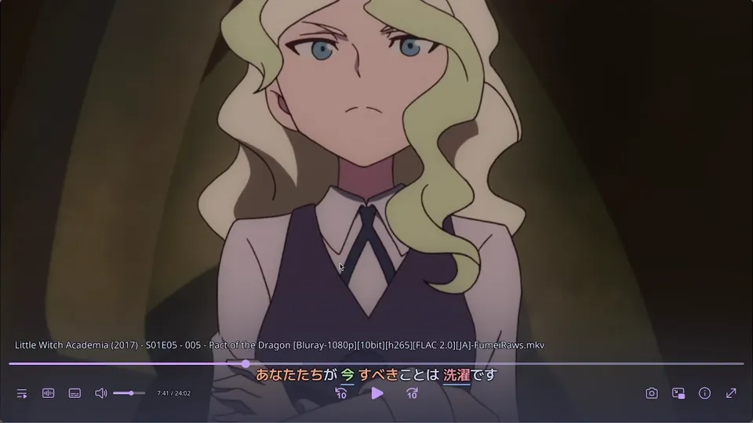
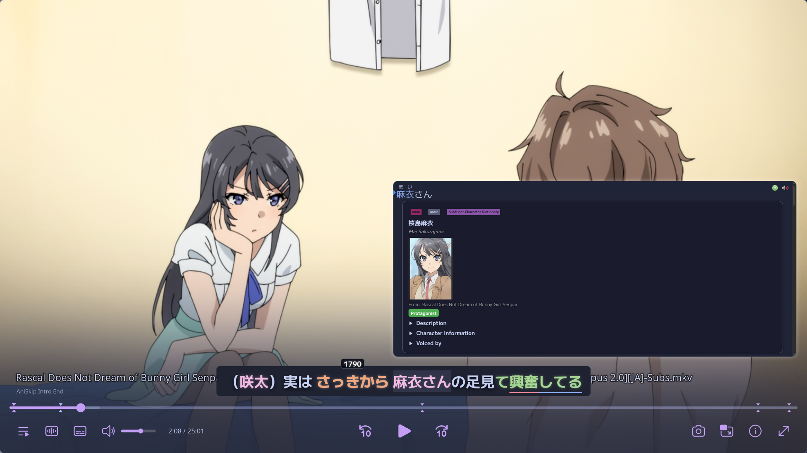
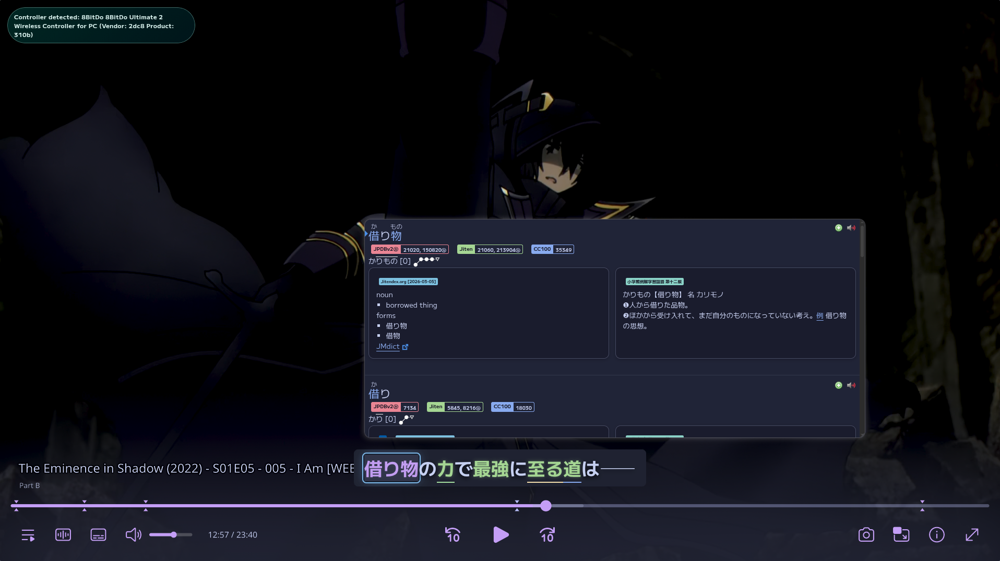
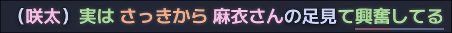
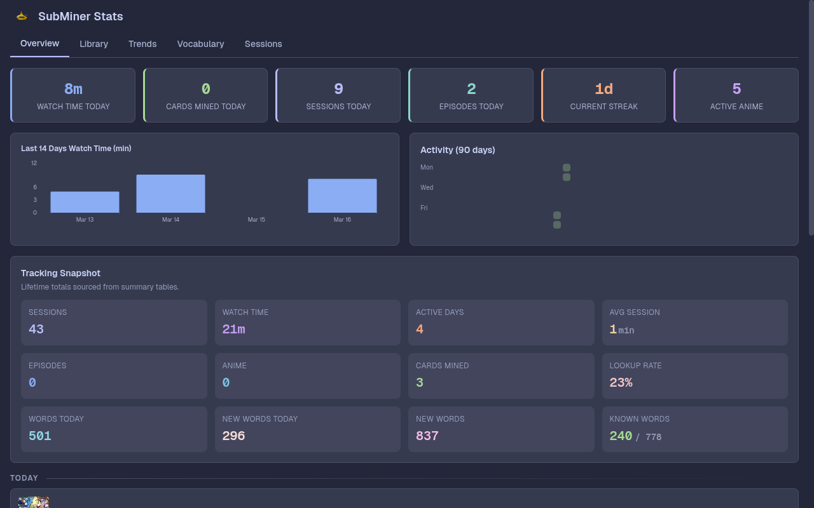

<div align="center">


# SubMiner

Look up words with Yomitan or Hachidori, mine them to Anki, and track your immersion without leaving mpv

[Installation](#quick-start) · [Requirements](#requirements) · [Usage](https://docs.subminer.moe/usage) · [Documentation](https://docs.subminer.moe)

[](https://github.com/ksyasuda/SubMiner/releases)
[](https://github.com/ksyasuda/SubMiner/releases/latest)
[](https://aur.archlinux.org/packages/subminer-bin)
[](https://github.com/ksyasuda/SubMiner)
[](https://www.gnu.org/licenses/gpl-3.0)
[](https://www.typescriptlang.org)

[](https://github.com/user-attachments/assets/7abab8a9-4e4e-4f06-9f3c-9783e15a3807)

</div>

## Features

### Dictionary Lookups

Hover over any word in the subtitles to open the full Yomitan popup with definitions, pitch accent, and frequency data. SubMiner bundles its own Yomitan, separate from any browser install.

Yomitan remains the default. Select the bundled Hachidori backend with `dictionaryBackend: "hachidori"` and restart SubMiner. The tray opens the selected backend's settings. See [dictionary setup](https://docs.subminer.moe/usage#hachidori-setup) for importing dictionaries, linking an external Hachidori host, and configuring Anki.

<div align="center">
  
</div>

<br>

### Instant Anki Mining

Create an Anki card from the exact playback moment with one key press, click, or controller input. SubMiner fills in the sentence, an audio clip, and a screenshot or animated image.

<div align="center">
  
</div>

<br>

### Reading Annotations

Subtitles are annotated as they play with frequency highlighting, JLPT tags, N+1 targeting, and character names from a generated dictionary. Particles and grammar-only tokens stay plain so the words worth learning stand out.

<div align="center">
  
</div>

<br>

### Immersion Dashboard

A stats dashboard tracks watch time, vocabulary growth, mining throughput, session history, and trends. Everything stays on your machine, with no third-party tracking.

<div align="center">
  
</div>

<br>

### Integrations

<table>
  <tr>
    <td><b>YouTube</b></td>
    <td>Play YouTube URLs with subtitle tracks picked by your language priorities, or choose tracks yourself in the overlay picker (<code>Ctrl+Alt+C</code>). Requires <code>yt-dlp</code></td>
  </tr>
  <tr>
    <td><b>AniList</b></td>
    <td>Automatic episode tracking and progress sync</td>
  </tr>
  <tr>
    <td><b>Jellyfin</b></td>
    <td>Browse your Jellyfin library, or cast to SubMiner from any Jellyfin client. Setup and discovery live in the tray menu</td>
  </tr>
  <tr>
    <td><b>Jimaku</b></td>
    <td>Search and download Japanese subtitles. Requires a free Jimaku API key</td>
  </tr>
  <tr>
    <td><b>TsukiHime</b></td>
    <td>Search and download subtitles extracted from anime releases, with Japanese and secondary-language tabs (<code>Ctrl+Shift+T</code>). Requires <code>xz</code> on your <code>PATH</code></td>
  </tr>
  <tr>
    <td><b>Subtitle generation</b></td>
    <td>Transcribe a video's audio into Japanese subtitles locally from the generation modal (<code>Ctrl+Shift+G</code>), the subtitle sidebar, or the launcher. SubMiner can download models for you; optional Silero speech detection helps focus on dialogue. Requires whisper.cpp and FFmpeg. <a href="https://docs.subminer.moe/subtitle-generation">Setup guide</a></td>
  </tr>
  <tr>
    <td><b>AniSkip</b></td>
    <td>Automatic intro detection with chapter markers and a one-key skip (<code>TAB</code> by default)</td>
  </tr>
  <tr>
    <td><b>alass / ffsubsync</b></td>
    <td>Retime a subtitle against the audio or another subtitle track (<code>Ctrl+Alt+S</code>). Requires <code>alass</code> or <code>ffsubsync</code>; set <code>subsync.alass_path</code> or <code>subsync.ffsubsync_path</code> if they are not in <code>/usr/bin</code></td>
  </tr>
  <tr>
    <td><b>WebSocket</b></td>
    <td>Plain subtitle feed plus a dedicated annotated feed for texthooker pages and custom tools</td>
  </tr>
</table>

<br>

---

## Requirements

SubMiner runs on Linux, macOS 11+, and Windows 10+. Only **mpv** is required to run it (plus `fuse2` for the Linux AppImage). Mining cards also needs Anki with the [AnkiConnect](https://ankiweb.net/shared/info/2055492159) add-on. Everything else is optional.

| Dependency               | Status           | What it does                                                         |
| ------------------------ | ---------------- | -------------------------------------------------------------------- |
| mpv                      | Required         | The video player SubMiner draws over                                 |
| fuse2                    | Required (Linux) | Running the AppImage                                                 |
| Anki + AnkiConnect       | Required to mine | Card creation from the Yomitan popup                                 |
| ffmpeg                   | Recommended      | Audio clips and screenshots on cards                                 |
| MeCab + mecab-ipadic     | Recommended      | More accurate N+1, JLPT, and frequency highlighting                  |
| xdotool + xwininfo       | Required (X11)   | Window tracking on desktops other than Hyprland or Sway              |
| yt-dlp                   | Optional         | YouTube playback                                                     |
| xz                       | Optional         | TsukiHime subtitle downloads (most Linux distros already have it)    |
| alass / ffsubsync        | Optional         | Subtitle sync                                                        |
| whisper.cpp              | Optional         | [Subtitle generation](https://docs.subminer.moe/subtitle-generation) |
| guessit                  | Optional         | Better title, season, and episode detection for AniSkip and AniList  |
| fzf / rofi               | Optional         | Video picker in the `subminer` launcher (rofi is Linux only)         |
| chafa, ffmpegthumbnailer | Optional         | Thumbnail previews in the launcher pickers                           |

<details>
<summary><b>Platform-specific install commands</b></summary>

**Arch Linux:**

```bash
sudo pacman -S --needed mpv ffmpeg
paru -S --needed mecab-git mecab-ipadic   # MeCab is only in the AUR
```

On desktops other than Hyprland or Sway, also install `xdotool` and `xorg-xwininfo`.

**macOS:**

```bash
brew install mpv ffmpeg mecab mecab-ipadic
```

**Windows:**

```powershell
winget install shinchiro.mpv
winget install Gyan.FFmpeg
```

Then reopen your terminal and check `mpv --version` and `ffmpeg -version`. ffmpeg must be on `PATH`; mpv does not have to be. If `mpv` is not found, either add its folder (usually `%LOCALAPPDATA%\Programs\mpv`) to `PATH` or enter the full path to `mpv.exe` during first-run setup.

[Scoop](https://scoop.sh) is the alternative if you want one package manager for everything. It is the only one that also carries `xz`:

```powershell
scoop bucket add extras
scoop install extras/mpv main/ffmpeg main/yt-dlp main/xz
```

See the [installation guide](https://docs.subminer.moe/installation#_1-install-requirements) for Ubuntu, Debian, and Fedora commands and the full optional package lists.

</details>

---

## Quick Start

### 1. Install SubMiner

<details>
<summary><b>Arch Linux (AUR)</b></summary>

```bash
paru -S subminer-bin
```

Includes the AppImage and the `subminer` command.

</details>

<details>
<summary><b>Linux (AppImage)</b></summary>

```bash
mkdir -p ~/.local/bin
wget https://github.com/ksyasuda/SubMiner/releases/latest/download/SubMiner.AppImage -O ~/.local/bin/SubMiner.AppImage \
 && chmod +x ~/.local/bin/SubMiner.AppImage
```

The AppImage is all you need. First-run setup can install the optional `subminer` command, which runs on a copy of Bun bundled with the app, so you do not need Bun installed.

</details>

<details>
<summary><b>macOS (DMG)</b></summary>

Download the latest DMG from [GitHub Releases](https://github.com/ksyasuda/SubMiner/releases/latest) and drag `SubMiner.app` into `/Applications`.

Then enable SubMiner under **System Settings > Privacy & Security > Accessibility**, or the overlay cannot follow the mpv window. If macOS blocks the first launch, right-click the app and choose **Open**.

</details>

<details>
<summary><b>Windows</b></summary>

Download and run the latest installer (`SubMiner-<version>.exe`) from [GitHub Releases](https://github.com/ksyasuda/SubMiner/releases/latest). A portable `.zip` is also available.

</details>

<details>
<summary><b>From source</b></summary>

See the [build-from-source guide](https://docs.subminer.moe/installation#from-source).

</details>

### 2. Launch & Set Up

Start SubMiner and the setup window opens on first launch. It creates your config file, imports Yomitan dictionaries (you need at least one for lookups), and can install the `subminer` command. On Windows it also creates a **SubMiner mpv** shortcut.

```bash
subminer app --setup                     # AUR
~/.local/bin/SubMiner.AppImage --setup   # AppImage
```

On **macOS**, open `SubMiner.app` from `/Applications`. On **Windows**, run SubMiner from the Start menu. To reopen setup later, run `subminer app --setup`.

For card creation, keep Anki open with AnkiConnect installed. SubMiner connects to it at its default address with no extra setup.

### 3. Mine

```bash
subminer video.mkv          # play a video with SubMiner
subminer /path/to/dir       # pick a file with fzf
subminer -R /path/to/dir    # pick a file with rofi (Linux only)
subminer -H                 # watch history: replay, next, or previous episode
subminer doctor             # check your setup
```

On **Windows**, double-click the **SubMiner mpv** shortcut or drag a video file onto it.

Starting mpv some other way? See [Launching mpv yourself](https://docs.subminer.moe/installation#launching-mpv-yourself) for the IPC socket option the overlay needs.

## Documentation

Full guides on configuration, Anki setup, Jellyfin, immersion tracking, and more: **[docs.subminer.moe](https://docs.subminer.moe)**

---

## Acknowledgments

SubMiner builds on the work of these open-source projects:

| Project                                                                                     | Role                                                                    |
| ------------------------------------------------------------------------------------------- | ----------------------------------------------------------------------- |
| [ani-skip](https://github.com/synacktraa/ani-skip)                                          | AniSkip API client for anime intro/outro skip timestamps                |
| [Anacreon-Script](https://github.com/friedrich-de/Anacreon-Script)                          | Inspiration for the mining workflow                                     |
| [asbplayer](https://github.com/killergerbah/asbplayer)                                      | Inspiration for subtitle sidebar and logic for YouTube subtitle parsing |
| [Bee's Character Dictionary](https://github.com/bee-san/Japanese_Character_Name_Dictionary) | Character name recognition in subtitles                                 |
| [Bun](https://github.com/oven-sh/bun)                                                       | Bundled runtime for the `subminer` command-line launcher                |
| [GameSentenceMiner](https://github.com/bpwhelan/GameSentenceMiner)                          | Inspiration for Electron overlay with Yomitan integration               |
| [jellyfin-mpv-shim](https://github.com/jellyfin/jellyfin-mpv-shim)                          | Jellyfin integration                                                    |
| [Jimaku.cc](https://jimaku.cc)                                                              | Japanese subtitle search and downloads                                  |
| [Renji's Texthooker Page](https://github.com/Renji-XD/texthooker-ui)                        | Base for the WebSocket texthooker integration                           |
| [Yomitan](https://github.com/yomidevs/yomitan)                                              | Default dictionary engine and morphological parser                     |
| [Hachidori](https://github.com/bee-san/hachidori)                                           | Alternative dictionary backend, powered by HoshiDicts                   |
| [yomitan-jlpt-vocab](https://github.com/stephenmk/yomitan-jlpt-vocab)                       | JLPT level tags for vocabulary                                          |

## License

SubMiner is released under the [GNU General Public License v3.0](LICENSE).

Release packages also bundle an unmodified copy of [Bun](https://github.com/oven-sh/bun), which is MIT licensed and statically links JavaScriptCore (LGPL 2.0) and TinyCC (LGPL 2.1). Its license texts and third-party notices ship inside the app under `resources/bun/licenses`, and each release publishes `bun-v1.3.5-source.tar.gz` with the corresponding source. See [Bundled Bun runtime](https://docs.subminer.moe/installation#bundled-bun-runtime).
