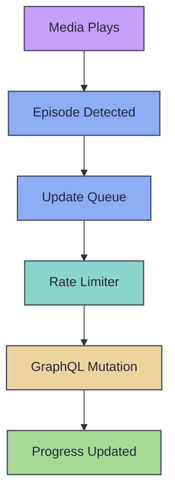

# AniList Integration

SubMiner can sync your watch progress to [AniList](https://anilist.co) automatically. When you finish an episode, SubMiner detects the title and episode number from the filename, finds the matching AniList entry, and updates your progress via the GraphQL API. Failed updates are retried with exponential backoff in the background.

AniList data also powers two additional features: [cover art](#cover-art) for the stats dashboard and the [Character Dictionary](/character-dictionary) for in-overlay name lookup.

## Setup

AniList integration is opt-in. To enable it:

1. Set `anilist.enabled` to `true` in your config.
2. Leave `anilist.accessToken` empty and restart SubMiner (or run `--anilist-setup`).
3. Approve access in the AniList authorization page.
4. The callback returns to SubMiner via the `subminer://anilist-setup?...` protocol URL, and SubMiner stores the token automatically.

```jsonc
{
  "anilist": {
    "enabled": true,
    "accessToken": ""
  }
}
```

The access token is encrypted at rest using Electron's `safeStorage` API. On Linux this defaults to `gnome-libsecret`; override the backend with `--password-store=<backend>` (for example `--password-store=basic_text`).

If the embedded auth UI fails to render, SubMiner opens the authorize URL in your default browser and shows fallback instructions in-app.

::: tip
You can also set `anilist.accessToken` directly in config to skip the setup flow entirely. When blank, SubMiner uses the locally stored encrypted token.
:::

## How Tracking Works

SubMiner monitors playback and triggers an AniList progress update when an episode is considered "watched" -- at least 85% of the episode duration viewed and a minimum of 10 minutes watched.

The update flow:

1. **Title detection** -- SubMiner extracts the anime title, season, and episode number from the media filename. It tries [`guessit`](https://github.com/guessit-io/guessit) first for accurate parsing, then falls back to an internal filename parser if guessit is unavailable.
2. **AniList search** -- The detected title is searched against the AniList GraphQL API. SubMiner picks the best match by comparing titles (romaji, English, native) and filtering by episode count.
3. **Progress check** -- SubMiner fetches your current list entry for the matched media. If your recorded progress already meets or exceeds the detected episode, the update is skipped.
4. **Mutation** -- A `SaveMediaListEntry` mutation sets the new progress and marks the entry as `CURRENT`.



## Update Queue and Retry

Failed AniList updates are persisted to a retry queue on disk and retried with exponential backoff.

| Parameter | Value |
| --- | --- |
| Initial backoff | 30 seconds |
| Maximum backoff | 6 hours |
| Maximum attempts | 8 |
| Queue capacity | 500 items |

After 8 failed attempts, the update is moved to a dead-letter queue and no longer retried automatically. The queue is persisted across restarts so no updates are lost if SubMiner exits before a retry succeeds.

Use `--anilist-retry-queue` to manually process one ready item from the queue.

## Cover Art

SubMiner fetches cover art from AniList for display in the stats dashboard. When a new video starts playing, the cover art fetcher:

1. Checks the local database for cached art.
2. If missing, parses the media title (guessit then fallback) and searches the AniList API.
3. Downloads the cover image from the AniList CDN and caches it locally (both URL and blob).
4. Stores AniList metadata (romaji/English titles, total episodes) alongside the cover for dashboard display.

A no-match result is cached for 5 minutes before SubMiner retries, preventing repeated API calls for unrecognized media.

## Rate Limiting

All AniList API calls go through a shared rate limiter that enforces a sliding window of 20 requests per minute. The limiter also reads AniList's `X-RateLimit-Remaining` and `Retry-After` response headers and pauses requests when the server signals throttling. This applies to both episode tracking and cover art fetching.

## Configuration Reference

```jsonc
{
  "anilist": {
    "enabled": true,
    "accessToken": "",
    "characterDictionary": {
      "enabled": false,
      "maxLoaded": 3,
      "profileScope": "all",
      "collapsibleSections": {
        "description": false,
        "characterInformation": false,
        "voicedBy": false
      }
    }
  }
}
```

| Option | Values | Description |
| --- | --- | --- |
| `enabled` | `true`, `false` | Enable AniList post-watch progress updates (default: `false`) |
| `accessToken` | string | Explicit AniList access token override; when blank, SubMiner uses the stored encrypted token (default: `""`) |
| `characterDictionary.enabled` | `true`, `false` | Enable auto-sync of the merged character dictionary from AniList (default: `false`) |
| `characterDictionary.maxLoaded` | number | Number of recent media snapshots kept in the merged dictionary (default: `3`) |
| `characterDictionary.profileScope` | `"all"`, `"active"` | Apply dictionary to all Yomitan profiles or only the active one |
| `characterDictionary.collapsibleSections.*` | `true`, `false` | Control which dictionary entry sections start expanded |

See the [Character Dictionary](/character-dictionary) page for full details on the character dictionary feature, including name generation, matching, auto-sync lifecycle, and dictionary entry format.

## CLI Commands

| Command | Description |
| --- | --- |
| `--anilist-setup` | Open AniList setup/auth flow helper window |
| `--anilist-status` | Print current token resolution state and retry queue counters |
| `--anilist-logout` | Clear stored AniList token from local persisted state |
| `--anilist-retry-queue` | Process one ready retry queue item immediately |

## Troubleshooting

- **Updates not triggering:** Confirm `anilist.enabled` is `true`. SubMiner requires at least 85% of the episode watched and a minimum of 10 minutes. Short episodes or partial watches will not trigger an update.
- **Wrong episode or title matched:** Detection quality is best when `guessit` is installed and on your `PATH`. Without it, SubMiner falls back to internal filename parsing which can be less accurate with unusual naming conventions.
- **Token issues:** Run `--anilist-status` to check token state. If the token is invalid or expired, run `--anilist-setup` or `--anilist-logout` and re-authenticate.
- **Updates failing repeatedly:** Run `--anilist-status` to see retry queue counters. Items that fail 8 times are moved to the dead-letter queue. Check network connectivity and AniList API status.
- **Cover art missing:** Cover art is fetched on a best-effort basis using title matching. If the filename is hard to parse, the search may return no results. The fetcher retries after 5 minutes.
- **Encryption unavailable on Linux:** If you see warnings about safeStorage, try `--password-store=basic_text` as a workaround, or ensure your desktop keyring (gnome-keyring, KWallet) is running.

## Related

- [Character Dictionary](/character-dictionary) -- AniList-powered character name dictionary for Yomitan
- [Configuration Reference](/configuration) -- full config options
- [Jellyfin Integration](/jellyfin-integration) -- media server integration
