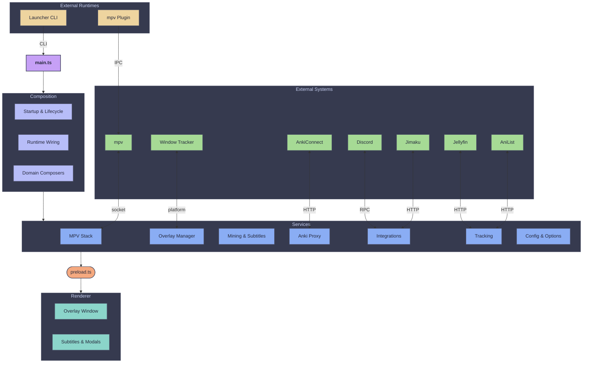
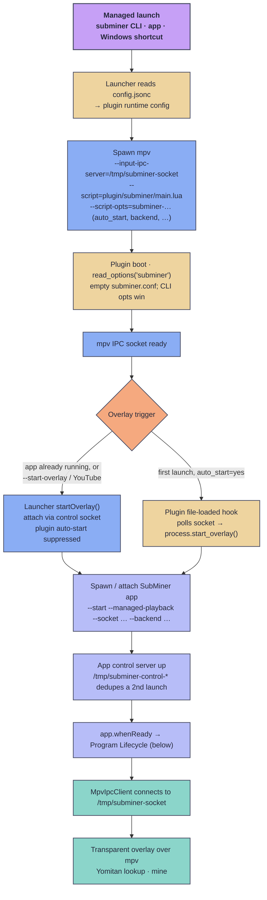
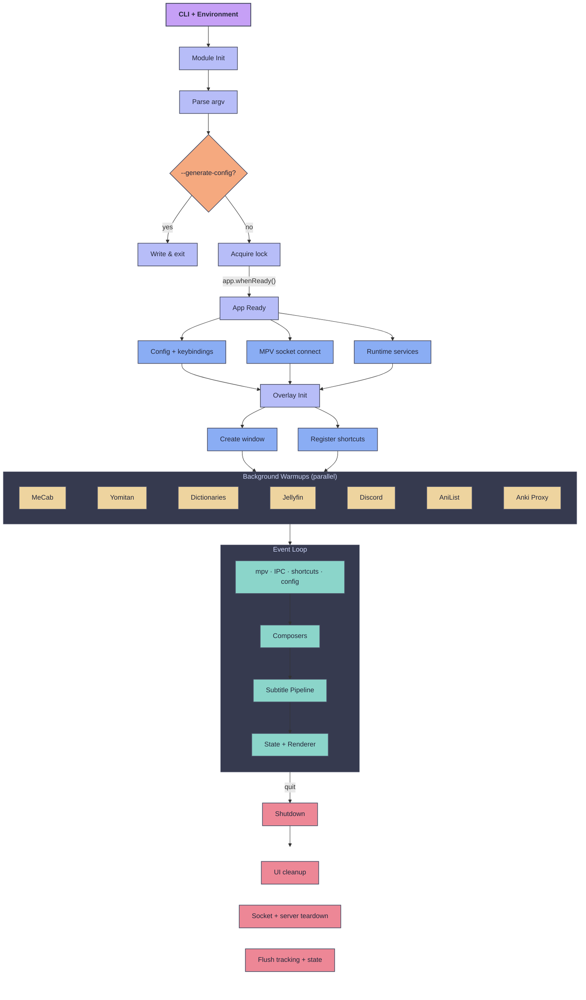
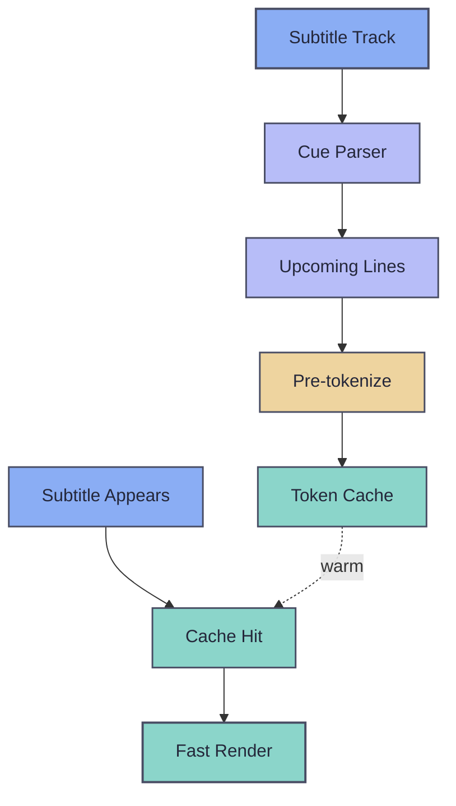

# Architecture

A contributor-facing map of how SubMiner is put together. The canonical internal guidance, including domain ownership and layering rules, is [`docs/architecture/README.md`](https://github.com/ksyasuda/SubMiner/blob/main/docs/architecture/README.md) in the repo.

SubMiner runs as three cooperating runtimes:

- the Electron desktop app (`src/`): overlay, UI, and runtime orchestration
- the launcher CLI (`launcher/`): mpv and app command workflows
- the mpv Lua plugin (`plugin/subminer/`): player-side controls and handoff to the app

Inside the app, `src/main.ts` is a composition root. It owns wiring and state, and delegates behavior to small runtime and domain modules that can be tested without Electron or mpv.

## Project layout

```text
launcher/
  main.ts                 # entrypoint and command dispatch
  commands/               # one module per subcommand (playback, jellyfin, stats, sync, ...)
  config/                 # launcher config readers and CLI parser
plugin/subminer/          # mpv plugin; main.lua loads init.lua, which boots the other modules
src/
  main-entry.ts           # bootstrap wrapper that runs before main.js
  main.ts                 # composition root
  preload*.ts             # preload bridges (overlay, settings, stats, sync, Jellyfin setup)
  main/                   # main-process runtime modules and IPC/CLI wiring
    boot/                 # pre-ready boot helpers
    runtime/composers/    # larger runtime clusters assembled for main.ts
    runtime/domains/      # domain barrels (startup, overlay, mpv, ipc, shortcuts, anilist, jellyfin, mining)
  core/services/          # focused services: mpv client, overlay, tokenizer, mining, integrations, stats
  core/utils/             # pure helpers
  shared/ipc/             # IPC channel constants and payload validators
  renderer/               # overlay renderer: subtitle rendering, input handlers, modals
  config/                 # definitions/ (defaults + option registries) and resolve/ (resolution pipeline)
  cli/                    # app CLI parsing and help output
  settings/, syncui/      # settings and sync windows
  window-trackers/        # Hyprland, Sway, X11, macOS, and Windows trackers
  anki-integration/       # AnkiConnect proxy and note-update workflow
  jimaku/, subsync/, tsukihime/  # integration helpers
  types/                  # shared domain types
stats/                    # stats dashboard UI (Vite)
vendor/                   # Yomitan fork, texthooker-ui, JLPT vocab
```

A few ownership notes that are hard to guess from file names:

- mpv access is split into transport (`mpv-transport.ts`), protocol (`mpv-protocol.ts`), and property modules under `src/core/services/`.
- The renderer keeps `renderer.ts` to orchestration. Keyboard, mouse, and gamepad input live in `renderer/handlers/`, and each modal flow has its own file in `renderer/modals/`.
- AniSkip intro detection runs in the app (`src/main/runtime/aniskip-runtime.ts`), which drives mpv chapters and the skip key over the mpv IPC socket. The plugin does not handle it.

## Component diagram

The main process drives one primary overlay window plus modal surfaces. Primary and secondary subtitle layers render in the same overlay renderer, connected to the main process through `preload.ts`. The launcher and mpv plugin run as separate processes and talk to the app through sockets or CLI passthrough.



## Composition pattern

Runtime code uses dependency injection:

1. Put the logic in a service under `src/core/services/`, as pure or side-effect-bounded functions.
2. Build its runtime dependencies in a `src/main/` module. Pass simple dependencies inline; extract an adapter only when it adds behavior or gets reused.
3. Call the service from lifecycle or command wiring.

`main.ts` gets domain handlers through `createMainRuntimeRegistry()` (`src/main/runtime/registry.ts`), which exposes the barrels in `src/main/runtime/domains/`. Larger clusters, such as app-ready startup, mpv, Jellyfin, AniList tracking, shortcuts, and IPC, are assembled by composers in `src/main/runtime/composers/`. Many handlers take a `*MainDeps` object built by a `createBuild*MainDepsHandler` builder, which keeps side effects out of the unit under test.

Composers declare their inputs with `ComposerInputs<T>` and results with `ComposerOutputs<T>` from `src/main/runtime/composers/contracts.ts`. A missing dependency then fails at compile time.

### IPC boundary

Channel names live in `src/shared/ipc/contracts.ts` and payload validators in `src/shared/ipc/validators.ts`. Renderer payloads are validated at the IPC entry points (`src/core/services/ipc.ts`, `src/core/services/anki-jimaku-ipc.ts`) before any domain handler runs. See [IPC + runtime contracts](/ipc-contracts) for the full rules.

### Runtime state ownership

Some domains, such as AniList token, queue, and media-guess state, use reducer-style transitions:

- Composition modules own the mutable state and expose narrow `get*`/`set*` accessors.
- Handlers change another domain's state only through its transition helpers in `src/main/state.ts`, never by mutating the object directly.
- A transition may update derived counters or snapshots, but must leave metadata it does not own untouched.
- Tests for these domains check both the fields that should change and the ones that should not.

## Playback startup flow

A SubMiner-managed launch (the `subminer` launcher, the app's own playback, or the packaged Windows shortcut) starts mpv, injects the plugin, and brings up the overlay. The launcher reads `config.jsonc`, spawns mpv with the IPC socket and the bundled plugin, and passes runtime settings as `--script-opts`. The plugin never reads a config file: the shipped `subminer.conf` has no settings, so command-line options always win.

Once mpv is up, exactly one of two triggers starts the overlay:

- On a first launch, the launcher sets `auto_start=yes` and the plugin's `file-loaded` hook starts the app once the socket is ready.
- When the app is already running, or for `--start-overlay` and YouTube flows, the launcher attaches over the app control socket and suppresses the plugin's auto-start.

Both paths end in the same app bring-up, which then runs the program lifecycle below.



The sockets in this flow are described in [IPC + runtime contracts](./ipc-contracts#runtime-sockets).

## Program lifecycle

1. **Module init.** Before `app.ready`, the composition root registers protocols, sets platform flags, constructs services, and wires dependencies. `runAndApplyStartupState()` parses CLI args and detects the compositor backend.
2. **Startup.** `--generate-config` writes the template and exits. Otherwise `app-lifecycle.ts` takes the single-instance lock and registers Electron lifecycle hooks.
3. **App ready.** `composeAppReadyRuntime()` reloads config strictly, resolves keybindings, creates the `MpvIpcClient` (which connects and observes subtitle and playback properties), and starts the runtime options manager, subtitle timing tracker, and immersion tracker.
4. **Overlay.** `initializeOverlayRuntime()` creates the overlay window, registers global shortcuts, and tracks mpv's window bounds through the active window tracker. `src/main/runtime/overlay-mpv-sub-visibility.ts` hides mpv's own subtitles while the overlay shows them.
5. **Background warmups.** MeCab, Yomitan, JLPT and frequency dictionaries, the optional Jellyfin remote session, Discord presence, AniList token refresh, and the optional AnkiConnect proxy start asynchronously. `startupWarmups` controls which run; its low-power mode defers everything except Yomitan.
6. **Runtime.** Event-driven. mpv property changes, IPC messages, CLI commands, shortcuts, and config hot-reloads route through handlers and composers. Subtitle text goes through `SubtitleProcessingController` (normalize, tokenize, merge) and out to the overlay renderer and modals.
7. **Shutdown.** `onWillQuitCleanup` tears down the tray, config watcher, shortcuts, WebSocket and texthooker servers, mpv socket, window tracker, and Yomitan parser window. It flushes the immersion tracker to SQLite and stops Jellyfin, Discord, and the AnkiConnect proxy.



## Subtitle prefetch

SubMiner tokenizes upcoming subtitle lines before they appear, so they render from a warm cache. `SubtitlePrefetchService` (`src/core/services/subtitle-prefetch.ts`) gets the cue list from the active track: an external subtitle file, or for local media an embedded text track extracted with ffmpeg. It parses the cues with `subtitle-cue-parser.ts`, picks a window of upcoming lines from the playback position, and tokenizes them through the live pipeline, storing results in the `SubtitleProcessingController` cache.

Live subtitle processing always takes priority; the prefetcher pauses while the on-screen line is being processed. It recomputes its window on seek and re-prefetches when the cache is invalidated, for example after a word is marked known.



## Extension rules

- Add behavior to a service in `src/core/services/` or a focused module under `src/main/runtime/`. Keep new logic out of `main.ts`.
- For changes that span startup, overlay, mpv, or integration wiring, compose through `src/main/runtime/domains/` and `src/main/runtime/composers/` instead of wiring directly in `main.ts`.
- Add a cross-process channel in `src/shared/ipc/contracts.ts` first, validate it in `src/shared/ipc/validators.ts`, then wire the handler. See [IPC + runtime contracts](/ipc-contracts#add-a-new-ipc-action).
- Config is split by domain under `src/config/definitions/` and `src/config/resolve/`. Keep config changes in the matching domain file.
- Keep CLI flags and IPC channels stable unless a change is meant to break them.
- Add or update focused tests when a runtime boundary or contract changes, including malformed-payload tests for IPC.
