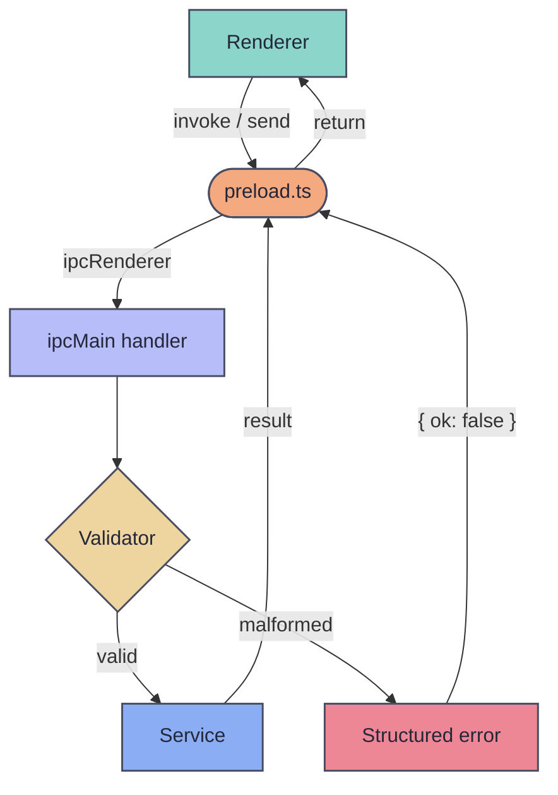
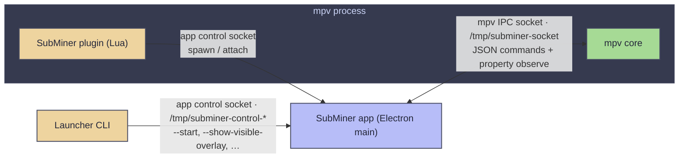

# IPC + runtime contracts

The Electron main and renderer processes talk only through IPC channels. The renderer is an untrusted surface: it loads Yomitan and renders subtitle text SubMiner did not write. Every payload that crosses the bridge goes through a validator before domain code sees it.

Channel names, payload validators, the preload bridge, and the handler change together. When you touch an IPC surface, update all four in the same commit.

## Message flow

Renderer calls pass through the preload bridge, the main-process handler, and a validator before they reach a service. Malformed payloads stop at the validator.

`IPC_CHANNELS` in `src/shared/ipc/contracts.ts` groups channels by pattern:

- `request`: invoke channels. The renderer awaits a result, for example lookups, config reads, and mining actions. Invalid payloads return a structured failure such as `{ ok: false, ... }` instead of throwing.
- `command`: fire-and-forget sends, for example focus events, UI state hints, and position updates. Invalid payloads are dropped.
- `event`: messages pushed from main to the renderer.

## Runtime sockets

The bridge above lives inside the Electron app. Separate OS sockets connect the app to mpv and to the launcher and plugin. They carry no renderer payloads and do not go through the contract and validator layer.

- **mpv IPC socket**: `/tmp/subminer-socket`, or `\\.\pipe\subminer-socket` on Windows. mpv creates it with `--input-ipc-server`. The app's `MpvIpcClient` sends JSON commands here and observes playback and subtitle properties.
- **App control socket**: `subminer-control-<uid>-<hash>.sock` in the temp directory, or `\\.\pipe\subminer-control-<hash>` on Windows. The launcher and plugin send CLI-style commands (`--start`, `--show-visible-overlay`, `--texthooker`) to a running app here. It also routes a second `subminer` invocation into the existing instance.

[Playback startup flow](./architecture#playback-startup-flow) shows when each socket comes up during a launch.

## Core files

| File                                   | Role                                                                                |
| -------------------------------------- | ----------------------------------------------------------------------------------- |
| `src/shared/ipc/contracts.ts`          | Channel names and payload types, shared by both processes                           |
| `src/shared/ipc/validators.ts`         | Runtime payload parsers and type guards                                             |
| `src/preload.ts`                       | Typed renderer API; only approved channels are exposed                              |
| `src/core/services/ipc.ts`             | Registers overlay handlers and validates payloads before calling domain logic       |
| `src/core/services/anki-jimaku-ipc.ts` | Same boundary for Anki and Jimaku operations                                        |
| `src/main/ipc-runtime.ts`              | Builds handler dependencies (via `src/main/dependencies.ts`) and registers handlers |
| `src/main/cli-runtime.ts`              | Handles commands from the launcher or mpv plugin, not the renderer                  |

## Contract rules

- **Use the shared constants.** Take channel names from `contracts.ts`, never string literals.
- **Validate before handling.** Every renderer payload goes through `validators.ts` before domain logic.
- **Return structured failures.** Invoke handlers return `{ ok: false, ... }` on failure instead of throwing, so the renderer can tell success from failure without try/catch.
- **Keep payloads narrow.** Send only what the handler needs, not whole state objects.
- **Keep handlers thin.** Validate, delegate to a service or composer, return. Route shared state changes through the transition helpers in `src/main/state.ts`.

## Add a new IPC action

1. Add the channel constant in `src/shared/ipc/contracts.ts`.
2. Add or extend the validator in `src/shared/ipc/validators.ts`.
3. Expose a typed bridge method in `src/preload.ts`.
4. Register the handler in `src/core/services/ipc.ts` (or `anki-jimaku-ipc.ts`), and supply any new dependency through `src/main/ipc-runtime.ts`.
5. Test valid and malformed payloads in `src/core/services/*`.
6. Update renderer tests if behavior or state transitions change.

## Troubleshooting

- **Handler receives an unexpected payload:** the validator is not applied. Check that the channel is registered through the IPC service with validation, not directly.
- **Renderer invoke fails:** check that the preload method exists, uses the right channel constant, and that the handler is registered and returns instead of throwing.
- **Invoke returns an unexpected shape:** compare the contract, validator, preload method, and handler side by side. One of them changed without the others.

## Related docs

- [Architecture](/architecture)
- [Building and testing](/development)
