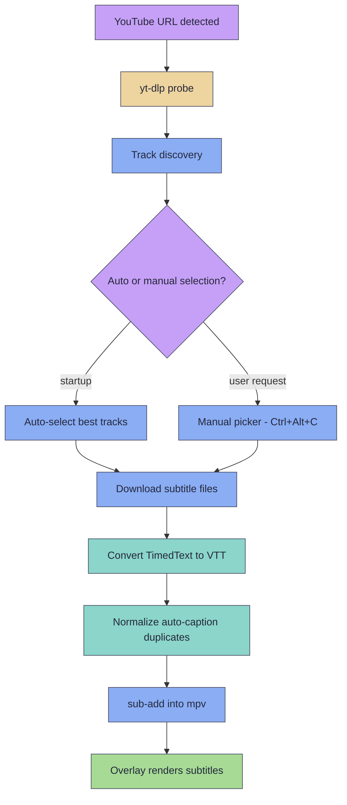

# YouTube Integration

SubMiner auto-loads Japanese subtitles when you play a YouTube URL, giving you the same sentence-mining overlay experience as local video files. It probes available subtitle tracks via `yt-dlp`, selects the best primary and secondary tracks, downloads them, and loads them into mpv before playback resumes.

## Requirements

- **[yt-dlp](https://github.com/yt-dlp/yt-dlp)** must be installed and on your `PATH`. yt-dlp is a free command-line tool that reads YouTube video and subtitle info; SubMiner calls it behind the scenes. (`PATH` is the list of folders your system searches for programs - most installers add yt-dlp to it automatically. If yours did not, set `SUBMINER_YTDLP_BIN` to the full path of the yt-dlp binary.)
- mpv with `--input-ipc-server` configured (handled automatically when you launch playback through the `subminer` launcher - no manual setup needed).

## How It Works

When SubMiner detects a YouTube URL (or `ytsearch:` target), it pauses mpv at startup and runs a subtitle pipeline before resuming playback:

1. **Probe** --- `yt-dlp --dump-single-json` extracts all available subtitle tracks (manual uploads and auto-generated captions) along with video metadata.
2. **Discover** --- Each track is normalized into a `YoutubeTrackOption` with language code, kind (`manual` or `auto`), display label, and direct download URL.
3. **Select** --- SubMiner picks the best primary track (Japanese, preferring manual over auto) and secondary track (English, preferring manual over auto).
4. **Download** --- Selected tracks are fetched via direct URL when available, falling back to `yt-dlp --write-subs` / `--write-auto-subs`. YouTube TimedText XML formats (`srv1`/`srv2`/`srv3`) are converted to VTT on the fly. Auto-generated VTT captions are normalized to remove rolling-caption duplication.
5. **Load** --- Subtitle files are injected into mpv via `sub-add`. Playback resumes once the primary track is ready; secondary failures do not block.

## Pipeline Diagram



## Auto-Load Flow

On startup with a YouTube URL:

1. mpv launches paused.
2. SubMiner calls `yt-dlp --dump-single-json` to probe all subtitle tracks.
3. Tracks are split into **manual** (human-uploaded) and **auto** (machine-generated) categories.
4. The selection algorithm picks:
   - **Primary**: first Japanese manual track, then Japanese auto track, then any manual track, then first available track.
   - **Secondary**: first English manual track, then English auto track (excluding the primary).
5. If mpv already exposes an authoritative matching track, SubMiner reuses it instead of downloading again.
6. Missing tracks are downloaded to a temp directory and loaded via `sub-add`.
7. Playback unpauses once the primary subtitle is ready.

## Manual Subtitle Picker

Press **Ctrl+Alt+C** during YouTube playback to open the subtitle picker overlay. This lets you:

- Browse all discovered tracks (manual and auto-generated)
- Select different primary and secondary tracks
- Retry track loading if the auto-load failed or picked the wrong track

SubMiner shows an "Opening YouTube subtitle picker..." status through your configured notification
surface while it probes tracks and prepares the modal, then updates the subtitle download progress
card to a success notification after the selected tracks load.

The picker displays each track with its language, kind (manual/auto), and title when available.

## Subtitle Format Handling

SubMiner handles several YouTube subtitle formats transparently:

| Format                 | Handling                                                 |
| ---------------------- | -------------------------------------------------------- |
| `srt`, `vtt`           | Used directly (preferred for manual tracks)              |
| `srv1`, `srv2`, `srv3` | YouTube TimedText XML --- converted to VTT automatically |
| Auto-generated VTT     | Normalized to remove rolling-caption text duplication    |

For auto-generated tracks, SubMiner prefers `srv3` > `srv2` > `srv1` > `vtt` (TimedText XML produces cleaner output). For manual tracks, `srt` > `vtt` is preferred.

## Card Media Cache

By default, YouTube card audio and screenshots are extracted directly from mpv's active stream URLs. If generated card media fails with YouTube `403` errors, set `youtube.mediaCache.mode` to `"background"`. Background mode starts a separate `yt-dlp` media download after playback loads, including YouTube URLs opened directly in mpv and resolved stream URLs when mpv still exposes the original YouTube playlist entry. It creates text fields immediately, queues audio/image work for mined notes, and fills those fields once the local cache file is ready.

Background cache downloads are capped at 720p by default (`youtube.mediaCache.maxHeight`; set `0` for unlimited) and use IPv4 and retry flags to reduce YouTube throttling failures. If the background download still fails, SubMiner shows a cache failure notification, shows queued-card failure notifications, and clears those pending updates so cards are not left waiting silently.

## Configuration Reference

### Primary Subtitle Languages

```jsonc
{
  "youtube": {
    "primarySubLanguages": ["ja", "jpn"],
  },
}
```

| Option                | Type       | Description                                                                           |
| --------------------- | ---------- | ------------------------------------------------------------------------------------- |
| `primarySubLanguages` | `string[]` | Languages that count as a satisfactory primary subtitle (default `["ja", "jpn"]`). Used by the "primary subtitle missing" notification and by managed local/playlist subtitle selection. |

YouTube auto-selection itself always picks a Japanese track first (manual over auto), then falls back to any manual track — `primarySubLanguages` does not change which YouTube track is auto-picked.

### Secondary Subtitle Languages

YouTube secondary selection is fixed: SubMiner always tries an English track (manual over auto) and loads it when found. The shared `secondarySub` config does not change YouTube track selection — `secondarySubLanguages` and `autoLoadSecondarySub` apply only to local/Jellyfin sidecar selection — but `defaultMode` still controls how the loaded secondary bar is displayed:

```jsonc
{
  "secondarySub": {
    "secondarySubLanguages": [],
    "autoLoadSecondarySub": false,
    "defaultMode": "hover",
  },
}
```

| Option                  | Type                                 | Description                                                                                                                                                                                         |
| ----------------------- | ------------------------------------ | --------------------------------------------------------------------------------------------------------------------------------------------------------------------------------------------------- |
| `secondarySubLanguages` | `string[]`                           | Extra language codes (e.g. `["eng", "en"]`) used when auto-selecting a secondary track for local/Jellyfin sidecar files. Default is empty (`[]`). Not used for YouTube. |
| `autoLoadSecondarySub`  | `boolean`                            | Auto-detect and load a matching secondary sidecar track for local files (default: `false`). Not used for YouTube.                                                       |
| `defaultMode`           | `"hidden"` / `"visible"` / `"hover"` | Initial display mode for secondary subtitles (default: `"hover"`)                                                                                                                                   |

These settings come from `config.jsonc` (or built-in defaults); there are no CLI flags or environment variables for subtitle language selection.

## Limitations and Troubleshooting

- **No subtitles found**: The video may not have Japanese subtitles. Open the picker with `Ctrl+Alt+C` to see all available tracks.
- **yt-dlp not found**: Install `yt-dlp` and ensure it is on `PATH`, or set `SUBMINER_YTDLP_BIN` to the binary path.
- **Probe timeout**: `yt-dlp` has a 15-second timeout per operation. Slow connections or rate-limited IPs may hit this. Retry or update `yt-dlp`.
- **Card media `403` errors**: Switch `youtube.mediaCache.mode` from `"direct"` to `"background"` so card media is generated from a local `yt-dlp` cache instead of ffmpeg reading an expiring YouTube stream URL.
- **Auto-caption quality**: YouTube auto-generated captions vary in quality. Manual subtitles (when available) are always preferred.
- **`ytsearch:` targets**: `subminer ytsearch:"keyword"` plays the first search result. Subtitle availability depends on the matched video.
- **Secondary subtitle fails**: Secondary track failures never block playback. The primary subtitle loads independently.
- **Native mpv secondary rendering**: Stays hidden during YouTube flows so the SubMiner overlay remains the visible secondary subtitle surface.

## Related Pages

- [Usage --- YouTube Playback](/usage#youtube-playback)
- [Configuration --- YouTube Playback Settings](/configuration#youtube-playback-settings)
- [Configuration --- Secondary Subtitles](/configuration#secondary-subtitles)
- [Keyboard Shortcuts](/shortcuts)
- [Jellyfin Integration](/jellyfin-integration)
