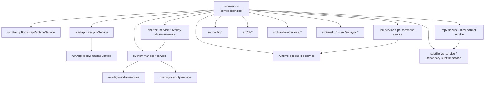
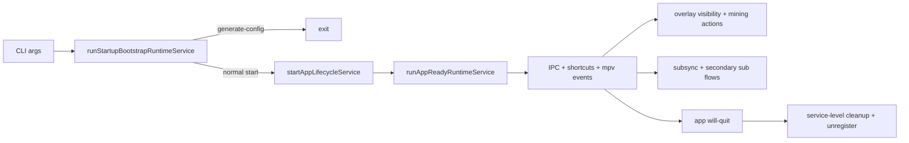

# Architecture

SubMiner uses a service-oriented Electron main-process architecture where `src/main.ts` acts as the composition root and behavior lives in small runtime services under `src/core/services`.

## Goals

- Keep behavior stable while reducing coupling.
- Prefer small, single-purpose units that can be tested in isolation.
- Keep `main.ts` focused on wiring and state ownership, not implementation detail.
- Follow Unix-style composability:
  - each service does one job
  - services compose through explicit inputs/outputs
  - orchestration is separate from implementation

## Current Structure

- `src/main.ts`
  - Composition root for lifecycle wiring and non-overlay runtime state.
  - Owns long-lived process state for trackers, runtime flags, and client instances.
  - Delegates behavior to services.
- `src/core/services/overlay-manager-service.ts`
  - Owns overlay/window state (`mainWindow`, `invisibleWindow`, visible/invisible overlay flags).
  - Provides a narrow state API used by `main.ts` and overlay services.
- `src/core/services/*`
  - Stateless or narrowly stateful units for a specific responsibility.
  - Examples: startup bootstrap/ready flow, app lifecycle wiring, CLI command handling, IPC registration, overlay visibility, MPV IPC behavior, shortcut registration, subtitle websocket, jimaku/subsync helpers.
- `src/core/utils/*`
  - Pure helpers and coercion/config utilities.
- `src/cli/*`
  - CLI parsing and help output.
- `src/config/*`
  - Config schema/definitions, defaults, validation, and template generation.
- `src/window-trackers/*`
  - Backend-specific tracker implementations plus selection index.
- `src/jimaku/*`, `src/subsync/*`
  - Domain-specific integration helpers.

## Flow Diagram

## Composition Pattern

Most runtime code follows a dependency-injection pattern:

1. Define a service interface in `src/core/services/*`.
2. Keep core logic in pure or side-effect-bounded functions.
3. Build runtime deps in `main.ts`; extract an adapter/helper only when it adds meaningful behavior or reuse.
4. Call the service from lifecycle/command wiring points.

This keeps side effects explicit and makes behavior easy to unit-test with fakes.

## Lifecycle Model

- Startup:
  - `runStartupBootstrapRuntimeService` handles initial argv/env/backend setup and decides generate-config flow vs app lifecycle start.
  - `app-lifecycle-service` handles Electron single-instance + lifecycle event registration.
  - `runAppReadyRuntimeService` performs ready-time initialization (config load, websocket policy, tokenizer/tracker setup, overlay auto-init decisions).
- Runtime:
  - CLI/shortcut/IPC events map to service calls.
  - Overlay and MPV state sync through dedicated services.
  - Runtime options and mining flows are coordinated via service boundaries.
- Shutdown:
  - `startAppLifecycleService` registers cleanup hooks (`will-quit`) while teardown behavior stays delegated to focused services from `main.ts`.

## Why This Design

- Smaller blast radius: changing one feature usually touches one service.
- Better testability: most behavior can be tested without Electron windows/mpv.
- Better reviewability: PRs can be scoped to one subsystem.
- Backward compatibility: CLI flags and IPC channels can remain stable while internals evolve.

## Extension Rules

- Add behavior to an existing service or a new `src/core/services/*` file, not as ad-hoc logic in `main.ts`.
- Keep service APIs explicit and narrowly scoped.
- Prefer additive changes that preserve existing CLI flags and IPC channel behavior.
- Add/update unit tests for each service extraction or behavior change.
- For cross-cutting changes, extract-first then refactor internals after parity is verified.
