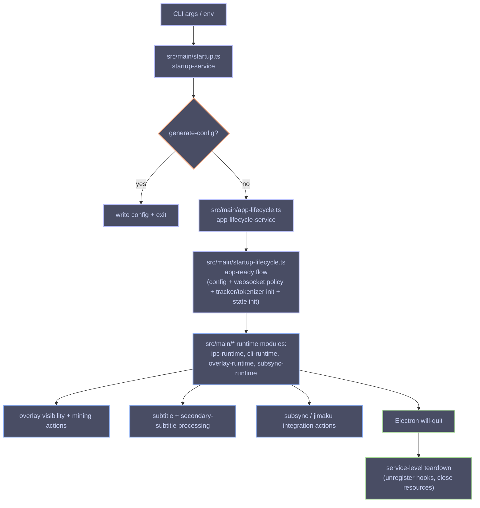

# Architecture

SubMiner uses a service-oriented Electron architecture with a composition-oriented main process and a modular renderer process.

## Goals

- Keep behavior stable while reducing coupling.
- Prefer small, single-purpose units that can be tested in isolation.
- Keep `main.ts` focused on wiring and state ownership, not implementation detail.
- Follow Unix-style composability:
  - each service does one job
  - services compose through explicit inputs/outputs
  - orchestration is separate from implementation

## Project Structure

```text
src/
  main.ts                  # Entry point — delegates to src/main/ composition modules
  preload.ts               # Electron preload bridge
  types.ts                 # Shared type definitions
  main/                    # Composition root modules (extracted from main.ts)
    app-lifecycle.ts       # Electron lifecycle event registration
    cli-runtime.ts         # CLI command handling and dispatch
    dependencies.ts        # Shared dependency builders for IPC/runtime
    ipc-mpv-command.ts     # MPV command composition helpers
    ipc-runtime.ts         # IPC channel registration and handlers
    overlay-runtime.ts      # Overlay window/modal selection and state
    overlay-shortcuts-runtime.ts # Overlay keyboard shortcut handling
    startup.ts              # Startup bootstrap flow (argv/env processing)
    startup-lifecycle.ts    # App-ready initialization sequence
    state.ts                # Application runtime state container
    subsync-runtime.ts      # Subsync command orchestration
  core/
    services/              # ~60 focused service modules (see below)
    utils/                 # Pure helpers and coercion/config utilities
  cli/                     # CLI parsing and help output
  config/                  # Config schema, defaults, validation, template generation
  renderer/                # Overlay renderer (modularized UI/runtime)
  window-trackers/         # Backend-specific tracker implementations (Hyprland, Sway, X11, macOS)
  jimaku/                  # Jimaku API integration helpers
  subsync/                 # Subtitle sync (alass/ffsubsync) helpers
  subtitle/                # Subtitle processing utilities
  tokenizers/              # Tokenizer implementations
  token-mergers/           # Token merge strategies
  translators/             # AI translation providers
```

### Service Layer (`src/core/services/`)

- **Startup** — `startup-service`, `app-lifecycle-service`, `app-ready-service`
- **Overlay** — `overlay-manager-service`, `overlay-window-service`, `overlay-visibility-service`, `overlay-bridge-service`, `overlay-runtime-init-service`, `overlay-content-measurement-service`
- **Shortcuts** — `shortcut-service`, `overlay-shortcut-service`, `overlay-shortcut-handler`, `shortcut-fallback-service`, `numeric-shortcut-service`, `numeric-shortcut-session-service`
- **MPV** — `mpv-service`, `mpv-control-service`, `mpv-render-metrics-service`, `mpv-transport`, `mpv-protocol`, `mpv-state`, `mpv-properties`
- **IPC** — `ipc-service`, `ipc-command-service`, `runtime-options-ipc-service`
- **Mining** — `mining-service`, `field-grouping-service`, `field-grouping-overlay-service`, `anki-jimaku-service`, `anki-jimaku-ipc-service`
- **Subtitles** — `subtitle-ws-service`, `subtitle-position-service`, `secondary-subtitle-service`, `tokenizer-service`
- **Integrations** — `jimaku-service`, `subsync-service`, `subsync-runner-service`, `texthooker-service`, `yomitan-extension-loader-service`, `yomitan-settings-service`
- **Config** — `runtime-config-service`, `cli-command-service`

### Renderer Layer (`src/renderer/`)

The overlay renderer is split by concern so `renderer.ts` stays focused on bootstrapping, IPC wiring, and module composition.

```text
src/renderer/
  renderer.ts              # Entrypoint/orchestration only
  context.ts               # Shared runtime context contract
  state.ts                 # Centralized renderer mutable state
  subtitle-render.ts       # Primary/secondary subtitle rendering + style application
  positioning.ts           # Visible/invisible positioning + mpv metrics layout
  handlers/
    keyboard.ts            # Keybindings, chord handling, modal key routing
    mouse.ts               # Hover/drag behavior, selection + observer wiring
  modals/
    jimaku.ts              # Jimaku modal flow
    kiku.ts                # Kiku field-grouping modal flow
    runtime-options.ts     # Runtime options modal flow
    subsync.ts             # Manual subsync modal flow
  utils/
    dom.ts                 # Required DOM lookups + typed handles
    platform.ts            # Layer/platform capability detection
```

## Flow Diagram

```mermaid
flowchart TD
  classDef root fill:#c6a0f6,stroke:#181926,color:#181926,stroke-width:2px;
  classDef orchestration fill:#494d64,stroke:#b7bdf8,color:#cad3f5,stroke-width:2px;
  classDef domain fill:#494d64,stroke:#8aadf4,color:#cad3f5,stroke-width:2px;
  classDef boundary fill:#494d64,stroke:#a6da95,color:#cad3f5,stroke-width:2px;

  subgraph Entry["Entrypoint"]
    Main["src/main.ts\nentry point"]
  end
  class Main root;

  subgraph MainModules["src/main/ Composition Modules"]
    Startup["startup.ts\nbootstrap flow"]
    AppLifecycle["app-lifecycle.ts\nlifecycle events"]
    StartupLifecycle["startup-lifecycle.ts\napp-ready sequence"]
    State["state.ts\nruntime state container"]
    IpcRuntime["ipc-runtime.ts\nIPC handlers"]
    CliRuntime["cli-runtime.ts\nCLI dispatch"]
    OverlayRuntime["overlay-runtime.ts\nwindow/modal"]
    SubsyncRuntime["subsync-runtime.ts\nsubsync orchestration"]
  end
  class Startup,AppLifecycle,StartupLifecycle,State,IpcRuntime,CliRuntime,OverlayRuntime,SubsyncRuntime orchestration;

  subgraph RuntimeServices["Runtime Domain Services"]
    OverlayMgr["overlay-manager-service"]
    OverlayWindow["overlay-window-service"]
    OverlayVisibility["overlay-visibility-service"]
    Ipc["ipc-service\nipc-command-service"]
    RuntimeOpts["runtime-options-ipc-service"]
    Mpv["mpv-service\nmpv-control-service"]
    MpvTransport["mpv-transport\nmpv-protocol"]
    Subtitle["subtitle-ws-service\nsecondary-subtitle-service"]
    Shortcuts["shortcut-service\noverlay-shortcut-service"]
  end
  class OverlayMgr,OverlayWindow,OverlayVisibility,Ipc,RuntimeOpts,Mpv,MpvTransport,Subtitle,Shortcuts domain;

  subgraph Adapters["External Boundaries"]
    Config["src/config/*"]
    Cli["src/cli/*"]
    Trackers["src/window-trackers/*"]
    Integrations["src/jimaku/*\nsrc/subsync/*"]
  end
  class Config,Cli,Trackers,Integrations boundary;

  Main -->|delegates to| Startup
  Main -->|registers| AppLifecycle
  AppLifecycle -->|triggers| StartupLifecycle
  StartupLifecycle -->|initializes| State

  Main -->|builds deps| IpcRuntime
  Main -->|builds deps| CliRuntime
  Main -->|builds deps| OverlayRuntime
  Main -->|builds deps| SubsyncRuntime

  IpcRuntime -->|registers| Ipc
  IpcRuntime -->|registers| RuntimeOpts
  CliRuntime -->|registers| Cli
  OverlayRuntime -->|manages| OverlayMgr
  OverlayRuntime -->|manages| OverlayWindow
  OverlayRuntime -->|manages| OverlayVisibility

  Main -->|loads| Config

  Ipc -->|updates| RuntimeOpts
  Mpv -->|feeds| Subtitle
  Shortcuts -->|drives| OverlayMgr
```



## Composition Pattern

Most runtime code follows a dependency-injection pattern:

1. Define a service interface in `src/core/services/*`.
2. Keep core logic in pure or side-effect-bounded functions.
3. Build runtime deps in `src/main/` composition modules; extract an adapter/helper only when it adds meaningful behavior or reuse.
4. Call the service from lifecycle/command wiring points.

The composition root (`src/main.ts`) delegates to focused modules in `src/main/`:
- `startup.ts` — argv/env processing and bootstrap flow
- `app-lifecycle.ts` — Electron lifecycle event registration
- `startup-lifecycle.ts` — app-ready initialization sequence
- `state.ts` — centralized application runtime state container
- `ipc-runtime.ts` — IPC channel registration and handler wiring
- `cli-runtime.ts` — CLI command parsing and dispatch
- `overlay-runtime.ts` — overlay window selection and modal state management
- `subsync-runtime.ts` — subsync command orchestration

This keeps side effects explicit and makes behavior easy to unit-test with fakes.

## Lifecycle Model

- **Startup:**
  - `src/main/startup.ts` (`startup-service`) handles initial argv/env/backend setup and decides generate-config flow vs app lifecycle start.
  - `src/main/app-lifecycle.ts` (`app-lifecycle-service`) handles Electron single-instance + lifecycle event registration.
  - `src/main/startup-lifecycle.ts` performs ready-time initialization (config load, websocket policy, tokenizer/tracker setup, overlay auto-init decisions).
- **Runtime:**
  - CLI/shortcut/IPC events map to service calls through `src/main/cli-runtime.ts`, `src/main/ipc-runtime.ts`, and `src/main/overlay-runtime.ts`.
  - Overlay and MPV state sync through dedicated services.
  - Runtime options and mining flows are coordinated via service boundaries.
- **Shutdown:**
  - `app-lifecycle-service` registers cleanup hooks (`will-quit`) while teardown behavior stays delegated to focused services from `src/main/*` composition modules.



## Why This Design

- **Smaller blast radius:** changing one feature usually touches one service.
- **Better testability:** most behavior can be tested without Electron windows/mpv.
- **Better reviewability:** PRs can be scoped to one subsystem.
- **Backward compatibility:** CLI flags and IPC channels can remain stable while internals evolve.
- **Extracted composition root:** TASK-27 refactored `main.ts` into focused modules under `src/main/`, isolating startup, lifecycle, IPC, CLI, and domain-specific runtime wiring.
- **Split MPV service:** TASK-27.4 separated `mpv-service.ts` into transport (`mpv-transport.ts`), protocol (`mpv-protocol.ts`), state (`mpv-state.ts`), and properties (`mpv-properties.ts`) layers for improved maintainability.

## Extension Rules

- Add behavior to an existing service in `src/core/services/*` or create a new focused module in `src/main/` for composition-level logic — not as ad-hoc logic in `main.ts`.
- Keep service APIs explicit and narrowly scoped.
- Prefer additive changes that preserve existing CLI flags and IPC channel behavior.
- Add/update unit tests for each service extraction or behavior change.
- For cross-cutting changes, extract-first then refactor internals after parity is verified.
- When adding new IPC channels or CLI commands, register them in the appropriate `src/main/` module (`ipc-runtime.ts` for IPC, `cli-runtime.ts` for CLI).
