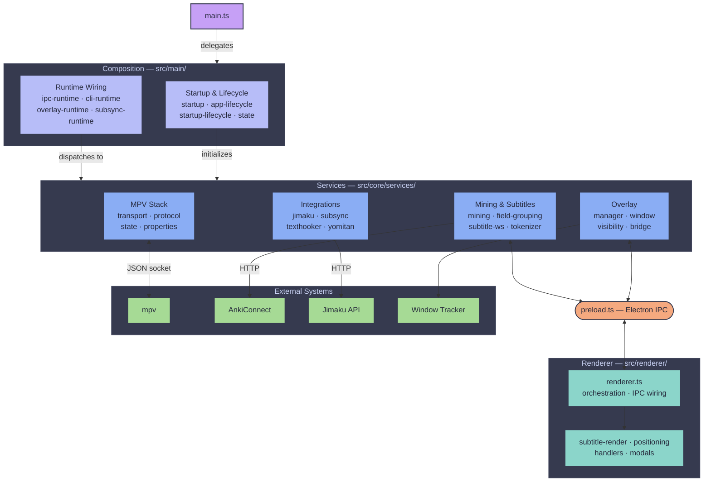
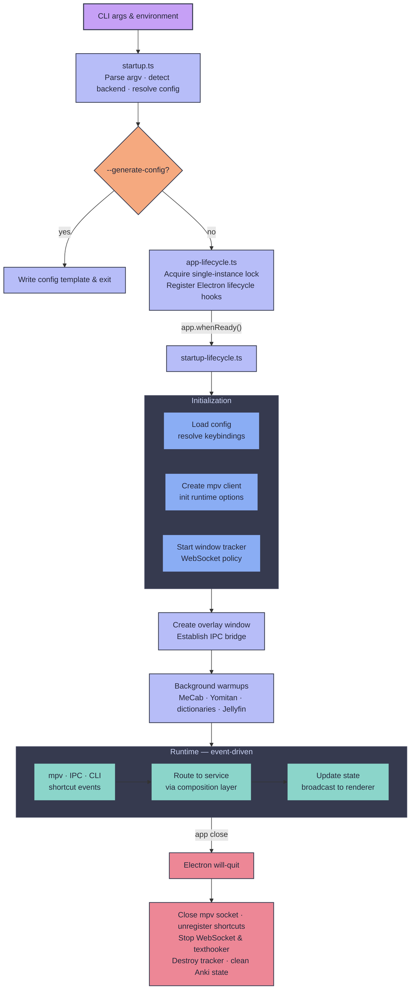

# Architecture

SubMiner uses a service-oriented Electron architecture with a composition-oriented main process and a modular renderer process.

## Goals

- Keep behavior stable while reducing coupling.
- Prefer small, single-purpose units that can be tested in isolation.
- Keep `main.ts` focused on wiring and state ownership, not implementation detail.
- Follow Unix-style composability:
  - each service does one job
  - services compose through explicit inputs/outputs
  - orchestration is separate from implementation

## Project Structure

```text
src/
  main.ts                  # Entry point — delegates to runtime composers/domain modules
  preload.ts               # Electron preload bridge
  types.ts                 # Shared type definitions
  main/                    # Composition root modules (extracted from main.ts)
    app-lifecycle.ts       # Electron lifecycle event registration
    cli-runtime.ts         # CLI command handling and dispatch
    dependencies.ts        # Shared dependency builders for IPC/runtime
    ipc-mpv-command.ts     # MPV command composition helpers
    ipc-runtime.ts         # IPC channel registration and handlers
    overlay-runtime.ts      # Overlay window/modal selection and state
    overlay-shortcuts-runtime.ts # Overlay keyboard shortcut handling
    startup.ts              # Startup bootstrap flow (argv/env processing)
    startup-lifecycle.ts    # App-ready initialization sequence
    state.ts                # Application runtime state container
    subsync-runtime.ts      # Subsync command orchestration
    runtime/
      composers/            # Composition assembly clusters consumed by main.ts
      domains/              # Domain barrel exports for runtime services
  core/
    services/              # ~60 focused service modules (see below)
    utils/                 # Pure helpers and coercion/config utilities
  cli/                     # CLI parsing and help output
  config/                  # Config schema, defaults, validation, template generation
  renderer/                # Overlay renderer (modularized UI/runtime)
  window-trackers/         # Backend-specific tracker implementations (Hyprland, Sway, X11, macOS)
  jimaku/                  # Jimaku API integration helpers
  subsync/                 # Subtitle sync (alass/ffsubsync) helpers
  subtitle/                # Subtitle processing utilities
  tokenizers/              # Tokenizer implementations
  token-mergers/           # Token merge strategies
  translators/             # AI translation providers
```

### Service Layer (`src/core/services/`)

- **Startup** — `startup-service`, `app-lifecycle-service`, `app-ready-service`
- **Overlay** — `overlay-manager-service`, `overlay-window-service`, `overlay-visibility-service`, `overlay-bridge-service`, `overlay-runtime-init-service`, `overlay-content-measurement-service`
- **Shortcuts** — `shortcut-service`, `overlay-shortcut-service`, `overlay-shortcut-handler`, `shortcut-fallback-service`, `numeric-shortcut-service`, `numeric-shortcut-session-service`
- **MPV** — `mpv-service`, `mpv-control-service`, `mpv-render-metrics-service`, `mpv-transport`, `mpv-protocol`, `mpv-state`, `mpv-properties`
- **IPC** — `ipc-service`, `ipc-command-service`, `runtime-options-ipc-service`
- **Mining** — `mining-service`, `field-grouping-service`, `field-grouping-overlay-service`, `anki-jimaku-service`, `anki-jimaku-ipc-service`
- **Subtitles** — `subtitle-ws-service`, `subtitle-position-service`, `secondary-subtitle-service`, `tokenizer-service`
- **Integrations** — `jimaku-service`, `subsync-service`, `subsync-runner-service`, `texthooker-service`, `yomitan-extension-loader-service`, `yomitan-settings-service`
- **Config** — `runtime-config-service`, `cli-command-service`

### Renderer Layer (`src/renderer/`)

The overlay renderer is split by concern so `renderer.ts` stays focused on bootstrapping, IPC wiring, and module composition.

```text
src/renderer/
  renderer.ts              # Entrypoint/orchestration only
  context.ts               # Shared runtime context contract
  state.ts                 # Centralized renderer mutable state
  subtitle-render.ts       # Primary/secondary subtitle rendering + style application
  positioning.ts           # Visible/invisible positioning + mpv metrics layout
  handlers/
    keyboard.ts            # Keybindings, chord handling, modal key routing
    mouse.ts               # Hover/drag behavior, selection + observer wiring
  modals/
    jimaku.ts              # Jimaku modal flow
    kiku.ts                # Kiku field-grouping modal flow
    runtime-options.ts     # Runtime options modal flow
    subsync.ts             # Manual subsync modal flow
  utils/
    dom.ts                 # Required DOM lookups + typed handles
    platform.ts            # Layer/platform capability detection
```

## Flow Diagram

The main process has three layers: `main.ts` delegates to composition modules that wire together domain services. The renderer runs in a separate Electron process, connected through `preload.ts`.



## Composition Pattern

Most runtime code follows a dependency-injection pattern:

1. Define a service interface in `src/core/services/*`.
2. Keep core logic in pure or side-effect-bounded functions.
3. Build runtime deps in `src/main/` composition modules; extract an adapter/helper only when it adds meaningful behavior or reuse.
4. Call the service from lifecycle/command wiring points.

The composition root (`src/main.ts`) delegates to focused modules in `src/main/` and `src/main/runtime/composers/`:

- `startup.ts` — argv/env processing and bootstrap flow
- `app-lifecycle.ts` — Electron lifecycle event registration
- `startup-lifecycle.ts` — app-ready initialization sequence
- `state.ts` — centralized application runtime state container
- `ipc-runtime.ts` — IPC channel registration and handler wiring
- `cli-runtime.ts` — CLI command parsing and dispatch
- `overlay-runtime.ts` — overlay window selection and modal state management
- `subsync-runtime.ts` — subsync command orchestration
- `runtime/composers/anilist-tracking-composer.ts` — AniList media tracking/probe/retry wiring
- `runtime/composers/jellyfin-runtime-composer.ts` — Jellyfin config/client/playback/command/setup composition wiring
- `runtime/composers/mpv-runtime-composer.ts` — MPV event/factory/tokenizer/warmup wiring

Composer modules share contract conventions via `src/main/runtime/composers/contracts.ts`:

- composer input surfaces are declared with `ComposerInputs<T>` so required dependencies cannot be omitted at compile time
- composer outputs are declared with `ComposerOutputs<T>` to keep result contracts explicit and stable
- builder return payload extraction should use shared type helpers instead of inline ad-hoc inference

This keeps side effects explicit and makes behavior easy to unit-test with fakes.

### IPC Contract + Validation Boundary

- Central channel constants live in `src/shared/ipc/contracts.ts` and are consumed by both main (`ipcMain`) and renderer preload (`ipcRenderer`) wiring.
- Runtime payload parsers/type guards live in `src/shared/ipc/validators.ts`.
- Rule: renderer-supplied payloads must be validated at IPC entry points (`src/core/services/ipc.ts`, `src/core/services/anki-jimaku-ipc.ts`) before calling domain handlers.
- Malformed invoke payloads return explicit structured errors (for example `{ ok: false, error: ... }`) and malformed fire-and-forget payloads are ignored safely.

### Runtime State Ownership (Migrated Domains)

For domains migrated to reducer-style transitions (for example AniList token/queue/media-guess runtime state), follow these rules:

- Composition/runtime modules own mutable state cells and expose narrow `get*`/`set*` accessors.
- Domain handlers do not mutate foreign state directly; they call explicit transition helpers that encode invariants.
- Transition helpers may sync derived counters/snapshots, but must preserve non-owned metadata unless the transition explicitly owns that metadata.
- Reducer boundary: when a domain has transition helpers in `src/main/state.ts`, new callsites should route updates through those helpers instead of ad-hoc object mutation in `main.ts` or composers.
- Tests for migrated domains should assert both the intended field changes and non-targeted field invariants.

## Program Lifecycle

- **Startup:** `startup.ts` parses CLI args and detects the compositor backend. If `--generate-config` is passed, it writes the template and exits. Otherwise `app-lifecycle.ts` acquires the single-instance lock and registers Electron lifecycle hooks.
- **Initialization:** Once `app.whenReady()` fires, `startup-lifecycle.ts` runs a short critical path first (config reload, keybindings, mpv client, overlay setup, IPC bridge), then schedules non-critical warmups in the background (MeCab availability check, Yomitan extension load, dictionary prewarm, optional Jellyfin remote startup).
- **Runtime:** Event-driven. mpv property changes, IPC messages, CLI commands, and keyboard shortcuts all route through the composition layer to domain services, which update state and broadcast to the renderer.
- **Shutdown:** Electron's `will-quit` triggers service teardown — closes the mpv socket, unregisters shortcuts, stops WebSocket and texthooker servers, destroys the window tracker, and cleans up Anki state.



## Why This Design

- **Smaller blast radius:** changing one feature usually touches one service.
- **Better testability:** most behavior can be tested without Electron windows/mpv.
- **Better reviewability:** PRs can be scoped to one subsystem.
- **Backward compatibility:** CLI flags and IPC channels can remain stable while internals evolve.
- **Extracted composition root:** `main.ts` delegates to focused modules under `src/main/` for startup, lifecycle, IPC, CLI, and domain runtime wiring.
- **Split MPV service layers:** MPV internals are separated into transport (`mpv-transport.ts`), protocol (`mpv-protocol.ts`), state (`mpv-state.ts`), and properties (`mpv-properties.ts`) for maintainability.

## Extension Rules

- Add behavior to an existing service in `src/core/services/*` or create a focused composition module in `src/main/` / `src/main/runtime/composers/` — not as ad-hoc logic in `main.ts`.
- Keep service APIs explicit and narrowly scoped.
- Prefer additive changes that preserve existing CLI flags and IPC channel behavior.
- Add/update unit tests for each service extraction or behavior change.
- For cross-cutting changes, extract-first then refactor internals after parity is verified.
- When adding new IPC channels or CLI commands, register them in the appropriate `src/main/` module (`ipc-runtime.ts` for IPC, `cli-runtime.ts` for CLI).
- When adding/changing IPC channels, update `src/shared/ipc/contracts.ts`, validate payloads in `src/shared/ipc/validators.ts`, and add malformed-payload tests.
